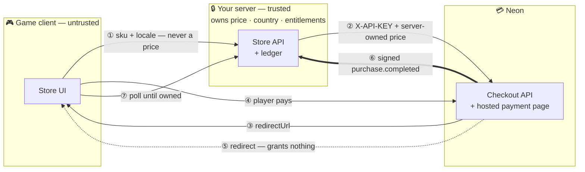

# Neon Checkout Integration — Constellation Defense

Companion documentation for the Neon checkout integration built into
**Constellation Defense**, an existing 3D match-3 tactics defense game.

| | |
|---|---|
| **Game / integration code** | <https://github.com/Hakhyun-Kim/constellation-defense> |
| **Integration type** | Hosted Checkout — server-created session → Neon-hosted page → signed webhook fulfillment |
| **Purchasable item** | `CELESTIAL_BANNER` — one permanent, cosmetic-only banner |
| **Runtime** | Node.js (no dependencies), static browser client, esbuild bundle |
| **Test** | `npm run store:check` — signed webhook, replay, and tamper coverage |

## The whole thing on one page



**The one rule everything else follows:** the dotted arrow grants nothing. Neon's
documentation states the player can reach `successUrl` before the webhook lands,
so the redirect only starts polling and the signed webhook is the sole writer of
entitlements.

## Why a separate repository

The game is a large pre-existing codebase (3D renderer, deterministic combat
engine, bilingual UI, Electron desktop build). Its own `README.md` is written for
players. This repository explains **only the payment integration**, so the design
can be understood without reading the game, and records the decisions,
assumptions, and open questions behind it.

## Two ways to read this

**Integrating Neon into your own game?** Start with
[00 — Integration guide](docs/00-integration-guide.md). It walks the whole flow
once, hands you the parts worth copying, and lists the six ways this goes wrong —
including the two that look like a Neon problem from the inside and do not show up
in a passing test suite. Then [07 — Sandbox checklist](docs/07-sandbox-checklist.md)
to get a first real purchase through.

**Reviewing this particular implementation?** Read 01 → 03 in order.

| Document | What it covers |
|---|---|
| [00 — Integration guide](docs/00-integration-guide.md) | **Start here to build your own.** The flow, the code worth copying, six failure modes, a porting checklist, and what changes for Unity/Unreal/mobile |
| [01 — Architecture](docs/01-architecture.md) | Components, files, trust boundary, data model |
| [02 — Checkout flow](docs/02-checkout-flow.md) | End-to-end sequence, the redirect/webhook race, idempotency |
| [03 — Decisions & assumptions](docs/03-decisions-and-assumptions.md) | Every non-obvious choice and why |
| [04 — Korean market notes](docs/04-korea-market-notes.md) | KRW, local rails, minors, refunds |
| [05 — Open questions for Neon](docs/05-open-questions-for-neon.md) | What is worth asking before a production launch |
| [06 — How AI was used](docs/06-ai-usage.md) | Tooling, division of labour, verification |
| [07 — Sandbox checklist](docs/07-sandbox-checklist.md) | Every Console and local step to run a real sandbox purchase |
| [08 — Storage & identity](docs/08-storage-and-identity.md) | Two late decisions, how each is verified, and every alternative that was dropped |
| [README-ko.md](README-ko.md) | 한국어 구현 요약 |

The server is a REST client, not an SDK binding — Neon publishes no Unity or
Unreal SDK. The same backend serves a web store, a game client, and a launcher;
only the last mile differs. [00](docs/00-integration-guide.md) covers that.

## Quickstart

Full purchase flow with **no Neon credentials**, using the built-in mock checkout:

```bash
git clone https://github.com/Hakhyun-Kim/constellation-defense
cd constellation-defense
npm install
npm run build
cp .env.example .env   # NEON_MOCK_CHECKOUT=1 is already set
npm run serve
```

Open <http://127.0.0.1:8642>, press **🛍️ 별빛 상점**, and buy the banner. Mock mode
exercises the same ledger, the same idempotent fulfillment path, and the same
polling UI — it only replaces the call to Neon.

Against the Neon sandbox, put the credentials in `.env` and point `PUBLIC_URL` at
a public tunnel — `npm run serve` loads `.env` through Node's own
`--env-file-if-exists` and warns about configurations that silently break a
checkout. [07 — Sandbox checklist](docs/07-sandbox-checklist.md) is the
step-by-step version, including what to verify and which negative tests to run.

## What is deliberately not built

Named here so scope is a decision rather than an omission.

- **Storefront / webshop** — out of scope for this integration.
- **Embedded and Direct checkout** — the same server endpoints support both; only
  Hosted is wired to the UI. See [03](docs/03-decisions-and-assumptions.md).
- **Dispute handling** — `dispute.opened` arrives as version 1 carrying only a
  `purchaseId`, and whether a chargeback should revoke on open or on close is a
  product policy decision rather than a technical one. Refunds *are* handled:
  `refund.processed` revokes the entitlement.
- **Durable storage** — fulfillment writes a single JSON file behind a queue.
  Production needs a transactional store; the interface is one file wide.
- **Real accounts** — the player identity is an `HttpOnly` cookie, not a login.
