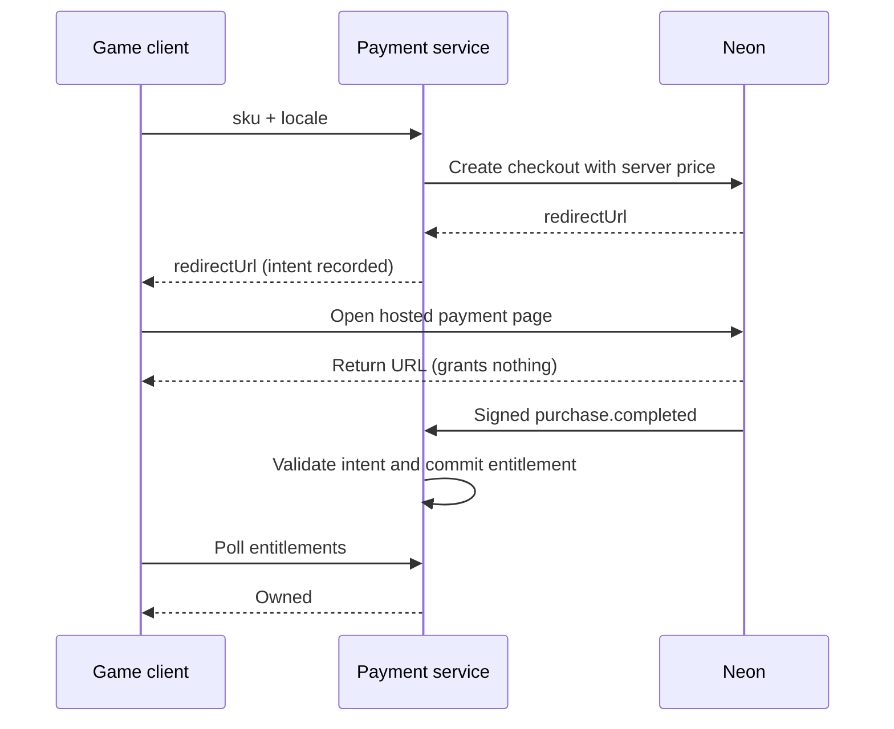

# Neon Hosted Checkout in Constellation Defense

A payment integration added to an existing 3D match-3 defense game. Buy one
permanent cosmetic banner and receive it after a signed purchase webhook.
The game engine and combat rules do not depend on payments.

**Source:** [constellation-defense](https://github.com/Hakhyun-Kim/constellation-defense).
This repository contains the accompanying documentation.

## Run locally

Requires Git and Node.js 22.9+ (for `--env-file-if-exists`).

```bash
git clone https://github.com/Hakhyun-Kim/constellation-defense
cd constellation-defense
npm ci
npm run build
cp .env.example .env
npm run serve
```

PowerShell: use `npm.cmd`. On Windows, double-click `start-demo.bat` after cloning
to install/build and open the mock tour. It selects mock mode without overwriting
an existing `.env`.

Open [the English checkout inspector](http://127.0.0.1:8642/?lang=en&demo=expert&tour=neon&mute).
It replaced the earlier scripted 13-step tour (2026-09-05): a panel observes
the ordinary store while you buy — five stages advance from real store events,
with source excerpts from the running build, live redacted HTTP evidence,
three independently refundable castle cosmetics delivered on the 3D castle,
and per-item test refunds. Purchases persist across reloads by design; use
**Test refund** (or delete `.data/`) to reset.

**Mock mode takes no payment and does not open Neon's hosted page.** It uses the
same fulfillment/revocation repository methods but bypasses valid signature
verification. For the normal click-and-return flow, open
[the English store](http://127.0.0.1:8642/?lang=en&store=1), click **Buy with Neon**,
and check **Owned** and the HUD flag. Use a fresh browser identity if already owned.

For Neon sandbox setup, follow [07 — Sandbox checklist](docs/07-sandbox-checklist.md).
The [recorded sandbox run](docs/09-sandbox-run.md) documents two completed purchases
and signed fulfillment. Real sandbox refunds remain unverified: the recorded
attempts returned HTTP 500. Synthetic refund tests are separate evidence.

## Design



- **Pricing:** `server/catalog.mjs` owns the allowlist and prices. Country selection
  is separate from display language.
- **Fulfillment:** raw-body HMAC, intent matching, event idempotency and checkout
  state checks. Early refunds are retained by purchase ID.
- **Storage:** JSON for one local process; Firestore transactions for multiple
  instances. Firestore is installed but only loaded when selected.
- **Porting:** reuse `server/neon-client.mjs` for the small HTTP adapter, or the
  `server/` service with your own catalog, identity and repository. The store UI
  and tour are game-specific adapters.
- **Game impact:** additive UI, localization and startup wiring; no integration
  changes to `src/engine/`, `src/tactics/` or `src/balance/`.

Accounts, saves, Firestore and the inspector grew beyond the initial checkout
example. The entire integration is not a 350-line SDK. See the
[current review](docs/12-review.md) for portability boundaries and production gaps,
including simultaneous pending purchases, cross-origin market selection and
API-only saves.

## Dedicated server mode

The game also runs as an authoritative server process with every client — the
web build, and Unity/Unreal samples — rendering its snapshots
(`start-dedicated.bat` / `./start-dedicated.command`). The intended direction
is for that server to become the only client-facing edge, brokering store
operations to the payment service so payment features become server-side
changes. Run instructions, the design, the current-vs-target payment topology
and its honest status are in [13 — Dedicated server](docs/13-dedicated-server.md).

## Verify

```bash
npm run store:check      # HTTP integration and real JSON write-failure regression
npm run service:check    # API health and private-file isolation
npm run tour:check       # bilingual inspector contract
npm run dedicated:check  # dedicated-server protocol: roles, schema, commands
npm run check            # all checks, build and asset budget
```

To include Firestore, start its emulator and set `FIRESTORE_EMULATOR_HOST` before
`store:check`. Otherwise the output explicitly reports a skip.

## Further reading

- [00 — Integration guide](docs/00-integration-guide.md)
- [03 — Decisions](docs/03-decisions-and-assumptions.md)
- [07 — Sandbox checklist](docs/07-sandbox-checklist.md)
- [09 — Sandbox results](docs/09-sandbox-run.md)
- [10 — Claims by development stage](docs/10-what-this-proves.md)
- [11 — Accounts and saves](docs/11-accounts-and-saves.md)
- [12 — Current review and limitations](docs/12-review.md)
- [13 — Dedicated server](docs/13-dedicated-server.md)
- [Earlier tour screenshots](docs/evidence/tour/) — historical, before this review
- [한국어 요약](README-ko.md)
