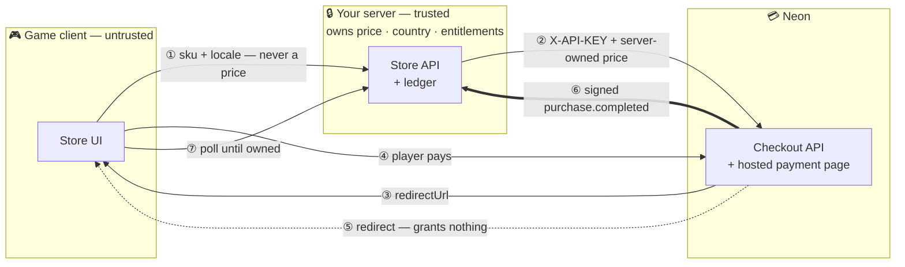

# Neon Checkout Integration — Constellation Defense

Companion documentation for the Neon checkout integration built into
**Constellation Defense**, an existing 3D match-3 tactics defense game.

| | |
|---|---|
| **Game / integration code** | <https://github.com/Hakhyun-Kim/constellation-defense> |
| **Integration type** | Hosted Checkout — server-created session → Neon-hosted page → signed webhook fulfillment |
| **Purchasable item** | `CELESTIAL_BANNER` — one permanent, cosmetic-only banner |
| **Runtime** | Node.js 22+; one optional dependency (`@google-cloud/firestore`), loaded only when that backend is selected |
| **Verified against** | Two real sandbox purchases (Naver Pay, card), fulfilled by signed webhooks — [09](docs/09-sandbox-run.md) |

## The whole thing on one page



**The one rule everything else follows:** the dotted arrow grants nothing. Neon's
documentation states the player can reach `successUrl` before the webhook lands,
so the redirect only starts polling and the signed webhook is the sole writer of
entitlements.

---

## Run it in five minutes

No Neon account, no credentials, no cloud project. The built-in **mock mode**
replaces only the call to Neon itself — the ledger, the idempotent fulfillment,
the refunds and the polling UI are the same code a real webhook reaches.

**You need:** [git](https://git-scm.com/) and [Node.js 22+](https://nodejs.org/)
(`node --version` to check).

**Step 1 — clone and install.**

```bash
git clone https://github.com/Hakhyun-Kim/constellation-defense
cd constellation-defense
npm install
```

**Step 2 — build the game bundle.**

```bash
npm run build
```

**Step 3 — create the config file.** The example already has mock mode switched
on, so copying it is the whole configuration:

```bash
cp .env.example .env
```

(On Windows `cp` works in PowerShell and Git Bash; in classic `cmd` use
`copy .env.example .env`.)

**Step 4 — start the server.**

```bash
npm run serve
```

You should see two lines — the mock-mode notice and
`Constellation Defense → http://localhost:8642/`. If port 8642 is taken, run
with another one: `PORT=9000 npm run serve`.

**Step 5 — buy something.** Open <http://127.0.0.1:8642>, click the
**🛍️ Celestial Store** button in the top bar, and press **Buy with Neon**. In
mock mode you will not see a payment page — the redirect comes straight back
with `?purchase=mock&…`, the client hands that reference to the server, and the
server pushes it through the exact same `fulfill()` a signed webhook would
reach. Within a second the button reads **Owned** and a 🚩 badge appears in the
game's HUD.

**Step 6 — see the proof.** The ledger is a readable JSON file:

```bash
cat .data/neon-store.json
```

You will find your checkout (`status: "fulfilled"`), your player record with the
entitlement, and the idempotency entry for the mock event. Delete `.data/` any
time to reset.

> **Prefer English?** Add `?lang=en` to the URL. The billing region stays
> KR · KRW either way — language never decides the billing country here, which
> is one of the design points the tour below demonstrates.

---

## The guided tour — the integration explaining itself

This is the fastest way to understand what was built. The game plays itself (a
bot, using the same inputs a person would) while a panel walks through the
entire payment lifecycle — and **almost every step fires a real request at the
server and prints the response it just received**. The JSON on screen is live,
not scripted.

With the server from Step 4 still running, open:

```
http://127.0.0.1:8642/?lang=en&demo=expert&tour=neon&mute
```

Korean version: `http://127.0.0.1:8642/?demo=%EA%B3%A0%EC%88%98&tour=neon&mute`

**Controls:** the panel advances on its own every 8 seconds. `⏸` pauses, `◀ ▶`
step manually, `✕` closes it. Reloading the page replays the tour cleanly — it
refunds its own purchase on start, so the duplicate-purchase guard cannot strand
it.

### What each step shows

Screenshots of a full run are in [docs/evidence/tour/](docs/evidence/tour/) —
one per step, captured in order.

| # | Step | What actually happens | Code involved |
|---|---|---|---|
| 1 | The run gets hard | The tour jumps the live game to wave 24; bosses join | `stage.hurry` hook in `src/main.js` |
| 2 | The citadel falls | Game over — the moment games usually sell power. This one sells a cosmetic, which is why fulfillment is provable by eye | `stage.fall` hook |
| 3 | The server decides the price | `GET /api/store/catalog` — price `490000`, currency, country all come back from the server; the browser computed none of them | `server/catalog.mjs` |
| 4 | ₩4,900 travels as 490000 | The same catalogue fetched as KR and as US, side by side — Neon's 100× integer format, display strings derived by `Intl` | `formatPrice()` in `server/catalog.mjs` |
| 5 | The client sends a SKU and a language | `POST /api/store/checkout` with `{sku, locale}` — no price, no currency, no country → `201`, intent recorded in the ledger | `server/store-api.mjs` |
| 6 | A forged webhook | The browser posts to `/api/webhooks/neon` with digest `deadbeef` → `403 invalid signature`. The endpoint is public; the signature is the only gatekeeper | `verifyWebhook()` |
| 7 | The real grant | The mock event passes signature-equivalent validation, account/SKU/amount matching, then writes the entitlement | `repository.fulfill()` |
| 8 | Account, not device | A transfer code is issued, then a request with **no cookie and no token** claims it and reads the entitlement it now owns | `/api/account/*` |
| 9 | Delivered twice | The same event id again → `duplicate: true`, still exactly one purchase | idempotency ledger |
| 10 | Buying what you own | A second checkout for the owned item → `409 already_owned` — the disabled button is UI, this is the real guard | ownership check in `store-api.mjs` |
| 11 | Refund | `revoked: true`; entitlement gone, purchase record kept with `refundedAt` | `repository.revoke()` |
| 12 | A grant after the refund | A *different* purchase event for the refunded checkout → `ignored: checkout is already refunded` — revocation cannot be resurrected | status guard in `fulfill()` |
| 13 | Architecture | One box per moving part: client → service → ledger → Neon | — |

Steps 6, 9, 10, 11 and 12 are the reason this demo exists: a payments reviewer
does not need the happy path performed — they need to see the failure cases
handled, live.

---

## Testing it yourself

### The focused suite

```bash
npm run store:check
```

Spins up the real HTTP server on an ephemeral port and runs ~50 assertions:
signature forgery, replay, client-side price/country tampering, environment
mismatch, refund revocation, the late-grant-after-refund race, transfer codes,
save-version conflicts, rate limiting, and the exact shape of the request that
goes to Neon. It deliberately tests the *failure* paths — the happy path is the
least interesting line in it.

### The same suite against Firestore

The JSON ledger is single-process; the Firestore backend moves the exactly-once
guarantee into transactions. The claim that both behave identically is tested,
not asserted — the suite runs against whichever backends are available:

```bash
# needs a JVM; one-time setup
gcloud components install cloud-firestore-emulator
gcloud emulators firestore start --host-port=127.0.0.1:8787

# in another terminal
FIRESTORE_EMULATOR_HOST=127.0.0.1:8787 npm run store:check
```

Both lines should end ✅. Without the emulator variable the Firestore half is
skipped and says so.

### The service and tour contracts

```bash
npm run service:check   # standalone API service: boot-time config judgement,
                        # health endpoints, graceful shutdown, serves no game files
npm run tour:check      # tour: ko/en symmetry, DOM contract, real endpoints wired
```

### Everything

```bash
npm run check
```

The project's full gate — 25+ verification scripts (game engine invariants
included) plus the build. Takes a few minutes; exits 0 when green.

### Poking the API by hand

With `npm run serve` running:

```bash
# what the client sees
curl "http://127.0.0.1:8642/api/store/catalog?locale=en"

# open a checkout the way the client does — try adding "price": 1 and
# watch the ledger record 490000 anyway
curl -X POST http://127.0.0.1:8642/api/store/checkout \
  -H "Content-Type: application/json" \
  -d '{"sku":"CELESTIAL_BANNER","locale":"en"}'

# forge a webhook — expect 403
curl -i -X POST http://127.0.0.1:8642/api/webhooks/neon \
  -H "x-neon-digest: deadbeef" -d '{}'
```

---

## Where the code lives

Everything payment-related in the game repo, in reading order:

| File | Role |
|---|---|
| `server/store-api.mjs` | HTTP routes, identity (token → cookie), country resolution, webhook verification and classification |
| `server/catalog.mjs` | The SKU allowlist and the only place prices exist |
| `server/repository.mjs` | JSON ledger: intents, entitlements, idempotency, refunds, transfer codes, saves |
| `server/firestore-repository.mjs` | The same five-method interface on Firestore transactions |
| `server/index.mjs` | Standalone service entry point — API + health, no game files |
| `server/config.mjs` · `logger.mjs` | Boot-time config judgement; text/JSON logging |
| `scripts/serve.mjs` | Dev server: static game files with the store API mounted on top |
| `src/app/neon-store.js` | Store UI, checkout launch, post-return polling, transfer-code UI |
| `src/app/neontour.js` | The guided tour |
| `scripts/store-server-check.mjs` | The suite described above |

The game engine (`src/engine/`) is untouched by all of this — payments never
reach inside the simulation.

## Running against the real Neon sandbox

Mock mode proves the machinery; the sandbox proves the contract.
[07 — Sandbox checklist](docs/07-sandbox-checklist.md) is the complete runbook:
provisioning a key, tunnelling webhooks to your machine, which Console events to
enable (and the two callbacks *not* to), what to verify after a purchase, and
the negative tests worth running. The results of doing exactly that are in
[09 — Sandbox run](docs/09-sandbox-run.md).

## Two ways to read the docs

**Integrating Neon into your own game?** Start with
[00 — Integration guide](docs/00-integration-guide.md) — the flow once through,
the code worth copying, and the six failure modes that do not show up in a
passing test suite. Then [07](docs/07-sandbox-checklist.md) for a first real
purchase.

**Reviewing this implementation?** Read 01 → 03, then 10.

| Document | What it covers |
|---|---|
| [00 — Integration guide](docs/00-integration-guide.md) | **Start here to build your own.** Flow, copyable code, six failure modes, porting checklist, Unity/Unreal/mobile notes |
| [01 — Architecture](docs/01-architecture.md) | Components, files, trust boundary, data model |
| [02 — Checkout flow](docs/02-checkout-flow.md) | End-to-end sequence, the redirect/webhook race, idempotency |
| [03 — Decisions & assumptions](docs/03-decisions-and-assumptions.md) | Every non-obvious choice and why |
| [04 — Korean market notes](docs/04-korea-market-notes.md) | KRW, local rails, minors, refunds |
| [05 — Open questions for Neon](docs/05-open-questions-for-neon.md) | What is worth asking before a production launch |
| [06 — How AI was used](docs/06-ai-usage.md) | Tooling, division of labour, verification |
| [07 — Sandbox checklist](docs/07-sandbox-checklist.md) | Every Console and local step for a real sandbox purchase |
| [08 — Storage & identity](docs/08-storage-and-identity.md) | Two late decisions and every alternative that was dropped |
| [09 — Sandbox run](docs/09-sandbox-run.md) | Two real purchases, what they answered, and the refund defect report |
| [10 — What this proves](docs/10-what-this-proves.md) | A claims ledger: five stages, evidence, and what each does not cover |
| [11 — Accounts & saves](docs/11-accounts-and-saves.md) | Transfer codes, versioned saves, and the conflict nobody handles |
| [Evidence](docs/evidence/) | Live-run screenshots and walkthrough video · [tour gallery](docs/evidence/tour/) |
| [README-ko.md](README-ko.md) | 한국어 요약 |

The server is a REST client, not an SDK binding — Neon publishes no Unity or
Unreal SDK. The same backend serves a web store, a game client, and a launcher;
only the last mile differs.

## What is deliberately not built

Named here so scope is a decision rather than an omission.

- **Storefront / webshop** — out of scope for this integration.
- **Embedded and Direct checkout** — the same server endpoints support both; only
  Hosted is wired to the UI. See [03](docs/03-decisions-and-assumptions.md).
- **Dispute handling** — `dispute.opened` arrives as version 1 carrying only a
  `purchaseId`, and revoke-on-open versus revoke-on-close is studio policy.
  Refunds *are* handled: `refund.processed` revokes the entitlement.
- **Authentication** — purchases follow an account, moved between devices by a
  single-use transfer code. Proving *who owns* the account (email, OAuth) is the
  part scoped out, and [11](docs/11-accounts-and-saves.md) explains why.
- **Deployment** — a `Dockerfile` and standalone service entry exist; nothing is
  hosted. [08](docs/08-storage-and-identity.md) records that reasoning.
