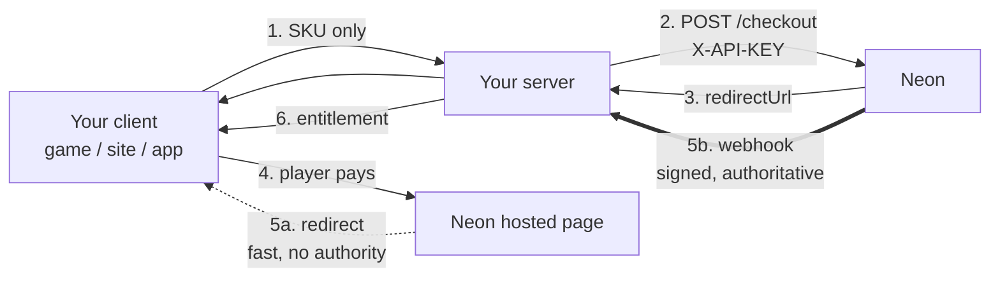
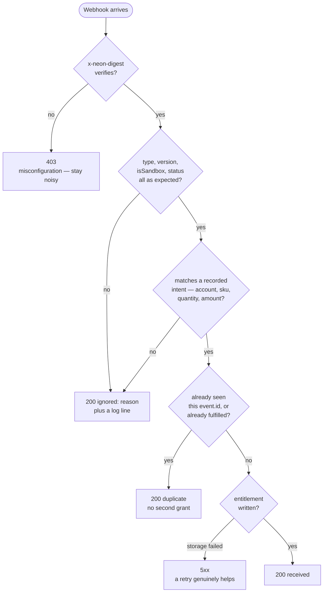

# 00 — Integration guide (start here)

For an engineer putting Neon checkout into their own game. This walks the whole
flow once, then hands you the parts worth copying and the six ways it goes wrong.

The reference implementation is a browser game, but **only the last section is
browser-specific**. Neon publishes no Unity or Unreal SDK — the integration is a
REST contract, so the server below is the same server regardless of what your
client is written in.

---

## 1. What you are actually building

Three moving parts, and one rule that decides the shape of all of them.



**The rule: the redirect never grants anything.** Neon's documentation states the
player can reach `successUrl` before the `purchase.completed` webhook arrives. So
the redirect is a UI event that starts polling, and the webhook is the only thing
that writes an entitlement. Build it that way from the first commit — retrofitting
this is a rewrite, not a patch.

## 2. Before you write code

| You need | Where from | Used as |
|---|---|---|
| Sandbox API key | Neon Console | `NEON_API_KEY`, server only |
| Webhook listener + secret | Neon Console | `NEON_WEBHOOK_SECRET` |
| A publicly reachable URL | `cloudflared tunnel --url http://localhost:PORT` | `PUBLIC_URL` |
| A stable player id | Your game | `accountId` on the checkout |

Confirm two things in the Console before you debug anything else: whether your
SKU must exist in **Inventory / Offers** first, and whether the currency you want
is enabled for your account. Both fail as a generic checkout rejection.

## 3. The minimum viable server

Four endpoints. In the reference implementation this is about 350 lines with no
runtime dependencies.

| Method | Path | Job |
|---|---|---|
| `GET` | `/api/store/catalog` | Localized, priced SKU list. The client never computes a price. |
| `POST` | `/api/store/checkout` | Create the Neon checkout, record the intent, return `redirectUrl`. |
| `POST` | `/api/webhooks/neon` | Verify, validate, fulfil. The only writer of entitlements. |
| `GET` | `/api/store/entitlements` | What this player owns. The client polls this after returning. |

### 3.1 Create the checkout

The client sends a SKU. The server supplies everything that costs money.

```js
const resolved = catalog[input.sku];              // allowlist, not client input
if (!resolved) return json(res, 400, { error: 'unknown product' });

const externalReferenceId = randomUUID();          // your handle on this purchase
const payload = {
  items: [{ sku: resolved.sku, name: resolved.name, price: resolved.price, quantity: 1 }],
  externalReferenceId,
  accountId,                                       // your player id
  languageLocale: 'ko-KR',
  playerCountry: country,                          // see pitfall 3
  currency: resolved.currency,                     // must match playerCountry
  storeUrl: origin, successUrl: `${origin}/?purchase=return`, cancelUrl: `${origin}/?purchase=cancelled`,
};

const checkout = await fetch(`${apiUrl}/checkout`, {
  method: 'POST',
  headers: { 'Content-Type': 'application/json', 'X-API-KEY': apiKey },
  body: JSON.stringify(payload),
}).then((r) => r.json());

await repository.recordCheckout({                  // record BEFORE redirecting
  externalReferenceId, accountId, sku: resolved.sku,
  price: resolved.price, currency: resolved.currency, status: 'pending',
});
```

Recording the intent before the player leaves is what lets the webhook prove the
purchase belongs to the account that started it.

### 3.2 Verify the webhook

Over the **raw bytes**. Parsing first and re-serializing breaks the digest.

```js
const expected = createHmac('sha256', secret).update(raw).digest('hex');
const received = String(req.headers['x-neon-digest'] || '').trim().toLowerCase();
// timingSafeEqual throws on unequal lengths — the length guard is required
const ok = received.length === expected.length
  && timingSafeEqual(Buffer.from(received), Buffer.from(expected));
```

### 3.3 Fulfil exactly once

```js
if (processedEvents[event.id]) return { duplicate: true };   // retries are normal
const pending = checkouts[purchase.externalReferenceId];
if (!pending)                          throw new PermanentRejection('unknown checkout reference');
if (pending.status === 'fulfilled')    throw new PermanentRejection('checkout already fulfilled');
if (pending.accountId !== purchase.accountId) throw new PermanentRejection('account mismatch');
if (pending.sku !== item.sku)          throw new PermanentRejection('sku mismatch');
if (item.price !== pending.price)      throw new PermanentRejection('amount mismatch');

grant(pending.entitlement, purchase.accountId);
processedEvents[event.id] = { purchaseId: purchase.id, at: now() };
```

Two independent guards: `event.id` catches redelivery of the same event, and the
`fulfilled` status catches a *different* event pointing at the same checkout.
Neither alone is enough.

### 3.4 Answer correctly

This is the decision most integrations get wrong, so it is worth drawing. Neon
retries any non-2xx for up to 36 hours — so the question is never "did this
succeed?", it is **"could a retry ever change the answer?"**



Everything reaching `200 {ignored}` is permanent: no retry will ever make an
unknown reference known, or a sandbox event belong in production. Only the
storage branch earns a `5xx`.

```js
// PermanentRejection → 200. Neon retries non-2xx for up to 36 hours,
// and none of the conditions above will ever pass on a retry.
if (error instanceof PermanentRejection) {
  log.warn(`webhook rejected: ${error.reason}`);
  return json(res, 200, { received: true, ignored: error.reason });
}
throw error;   // storage/network failure → 5xx, where a retry genuinely helps
```

## 4. The client side

```js
// 1. Buy: send a SKU, never a price
const { redirectUrl } = await post('/api/store/checkout', { sku, locale });
location.assign(redirectUrl);

// 2. On return: the redirect proves nothing. Ask the server.
if (params.get('purchase') === 'return') {
  for (let i = 0; i < 12; i += 1) {
    if (await ownsIt()) return showOwned();
    await sleep(1500);
  }
  showRetryButton();   // the entitlement still lands; only the UI gave up
}
```

If the poll window expires, leave a way to check again. The purchase is safe on
the server; the only thing that failed is the UI's patience.

## 5. Six ways this goes wrong

Each of these was hit, diagnosed, or designed around in the reference
implementation. The symptom column is what you will actually see first.

| # | Symptom | Cause | Fix |
|---|---|---|---|
| 1 | Webhooks arrive over and over for 36 hours | You returned `400`/`500` for something a retry can never fix | `200 {ignored: reason}` for permanent rejections; `5xx` only for transient failures |
| 2 | "Payment succeeded but the player owns nothing" | `successUrl` is a different origin than the player was on, so the session cookie did not survive the redirect | Build `successUrl` from the origin the player is actually browsing. `localhost` and `127.0.0.1` are different origins |
| 3 | Wrong currency, wrong payment methods, wrong tax | Country derived from UI language | Resolve country server-side: explicit choice → geo header → `Accept-Language` → default. Never the language toggle |
| 4 | Price is 100× off | Neon prices are 100× the base unit; currencies without a subunit (KRW, JPY) make this look like a typo | Encode the multiplier once, in one table; derive display strings with `Intl.NumberFormat` |
| 5 | Item granted, then granted again | Idempotency keyed only on `event.id` | Also refuse any grant against a checkout already marked fulfilled |
| 6 | Sandbox purchases appearing in production data | `isSandbox` delivered but not checked | Compare `isSandbox` against your own environment flag and ignore mismatches |

Pitfalls 1 and 2 are the expensive ones: both look like a Neon problem from the
inside, and neither shows up in a passing test suite.

## 6. Porting checklist

- [ ] API key lives on the server. Grep your client bundle to be sure.
- [ ] Client sends a SKU; price, currency and country all come from the server.
- [ ] Checkout intent is recorded before the player is redirected.
- [ ] Webhook signature verified over the raw body, with a length guard.
- [ ] Webhook cross-checks account, SKU, quantity and amount against the intent.
- [ ] Idempotent on `event.id` **and** on already-fulfilled checkouts.
- [ ] Permanent rejections answer `200`; only transient failures answer `5xx`.
- [ ] `isSandbox` checked against your environment.
- [ ] Client polls for entitlement after return, with a retry affordance.
- [ ] `successUrl` origin matches where the player actually is.
- [ ] A mock mode so the flow can be run and tested without credentials.

## 7. If your client is not a browser

The server above does not change. Only the last mile does.

| Client | What differs |
|---|---|
| **Web (this reference)** | Hosted redirect, or Embedded via `@neonpay/js` in an iframe — same server response, the client just consumes `checkoutId`/`token` instead of `redirectUrl` |
| **Unity / Unreal** | `UnityWebRequest` or `FHttpModule` in place of `fetch`; open `redirectUrl` with `Application.OpenURL` or the platform browser; poll your entitlement endpoint on return |
| **Mobile in-game** | Neon's guidance is to open `redirectUrl` in the **native browser** on iOS rather than an in-app webview; an in-game browser is fine on Android. Set `successUrl` to a deep link back into the game |
| **Desktop / launcher** | Same as mobile: external browser plus a deep link or a poll on focus |

Because the surface is a REST contract rather than an SDK, one backend can serve
a web store, a game client, and a launcher at once. That is worth designing for
even if you only ship one of them today.

## 8. Where to go next

- [01 — Architecture](01-architecture.md) — trust boundary and data model
- [02 — Checkout flow](02-checkout-flow.md) — the full sequence and the race
- [03 — Decisions](03-decisions-and-assumptions.md) — why each choice, and what is unfinished
- [04 — Korean market notes](04-korea-market-notes.md) — KRW, local rails, minors, refunds
- [07 — Sandbox checklist](07-sandbox-checklist.md) — the runbook for a first real purchase
