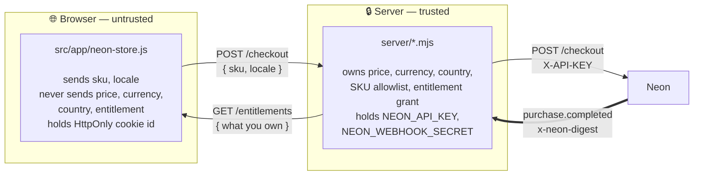
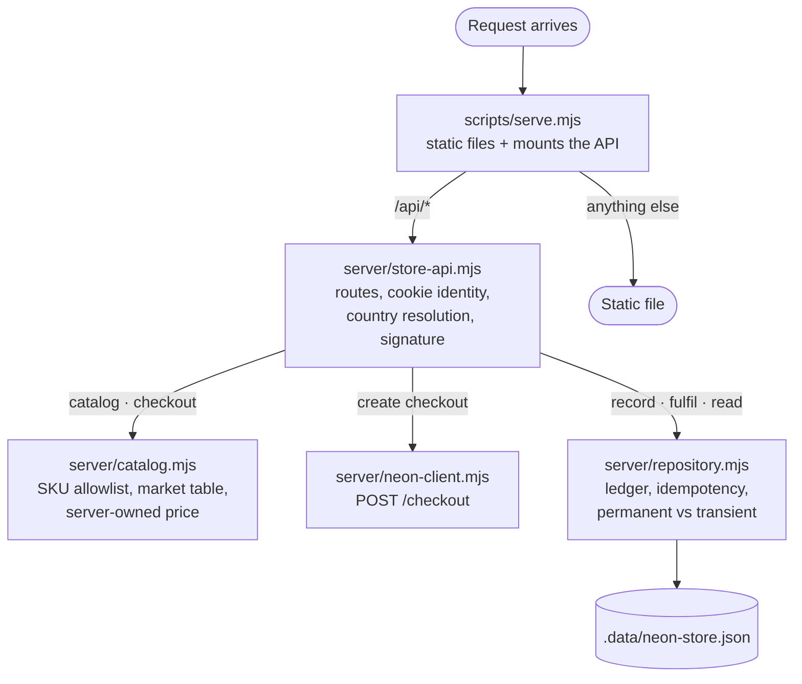

# 01 — Architecture

## The constraint that shaped everything

Constellation Defense was, before this work, a **100% static browser game**. It
builds to a single `dist/game.js` bundle and is published on GitHub Pages with no
server at all. Saves live in `localStorage`.

A payment integration cannot live in that world: the API key must never reach the
browser, and an entitlement the player can edit in devtools is not an entitlement.
So the integration adds the game's **first server-authoritative surface** while
leaving the static deployment intact — on GitHub Pages the store endpoints 404,
the catalog request fails, and the store button silently stays hidden. The game
is unchanged for players who never see a store.

## Components

```
constellation-defense/
├── server/                         ← new: the only trusted code
│   ├── catalog.mjs                 SKU allowlist, localized copy, server-owned prices
│   ├── neon-client.mjs             POST /checkout against the Neon API
│   ├── repository.mjs              checkout / purchase / entitlement ledger (JSON)
│   └── store-api.mjs               HTTP routes, cookie identity, webhook verification
├── scripts/
│   ├── serve.mjs                   static file server + mounts the store API
│   └── store-server-check.mjs      integration test (signature, replay, tamper)
├── src/app/neon-store.js           ← new: client store UI, checkout launch, polling
├── index.html · css/style.css      store button, modal, owned-badge
└── .env.example                    configuration surface
```

Total integration code is roughly 350 lines, no runtime dependencies. The game
engine (`src/engine/`) is untouched — it stays DOM-free and deterministic, which
is what lets the project's Node verification scripts keep running.

## Trust boundary



The double line is the only edge that can create an entitlement.

Three rules follow from this and are enforced in code:

1. **The client names a SKU, never a price.** `checkoutItem()` looks the SKU up in
   a frozen allowlist and reads the price from there. The integration test posts a
   deliberate `price: 1` alongside the SKU to prove the field is ignored.
2. **Entitlements are granted only by a verified webhook.** Neither the browser
   redirect nor the client's own claim of success can grant anything.
3. **Secrets stay in the process.** Nothing in `dist/game.js` references a key.

## How a request moves through the code

Which file owns which step, for anyone tracing a bug back to its source.



`store-api.mjs` is the only file that touches HTTP; `repository.mjs` is the only
file that decides whether something is granted. Keeping those separate is what
lets the whole fulfillment path be tested without a network.

## Data model

One JSON document at `.data/neon-store.json` (git-ignored), three collections:

| Collection | Key | Purpose |
|---|---|---|
| `checkouts` | `externalReferenceId` (UUID we mint) | The pending intent: which account asked for which SKU. The webhook is matched against this. |
| `players` | `accountId` (cookie UUID) | `entitlements` map and a `purchases` audit list. |
| `processedEvents` | Neon `event.id` | Idempotency ledger — a replayed webhook is a no-op. |

`JsonRepository.mutate()` serializes every write through a promise queue and
persists via write-temp-then-`rename`, so a crash mid-write cannot leave a torn
ledger. This is a deliberately small stand-in for a database; see
[03 — Decisions](03-decisions-and-assumptions.md).

## HTTP surface

| Method | Path | Purpose |
|---|---|---|
| `GET` | `/api/store/catalog?locale=` | Localized, priced SKU list. Also mints the player cookie. |
| `POST` | `/api/store/market` | Sets the billing country explicitly. The only way language-independent country changes. |
| `GET` | `/api/store/entitlements` | What this player owns. Polled after checkout return. |
| `POST` | `/api/store/checkout` | Creates the Neon checkout, records the pending intent, returns `redirectUrl`. |
| `POST` | `/api/webhooks/neon` | Verifies `x-neon-digest`, validates, fulfills. |
| `POST` | `/api/store/mock-complete` | **Mock mode only.** Simulates the webhook locally. |

## Player identity

`accountId` is a v4 UUID in an `HttpOnly; SameSite=Lax` cookie. Neon's model wants
a stable in-game account id; this game has no accounts, so the cookie is the
smallest honest substitute. It is `HttpOnly` specifically so the client script
cannot forge or read it. In a real title this would be the game's own player id and
would additionally be pinned with `POST /auth/token`.
