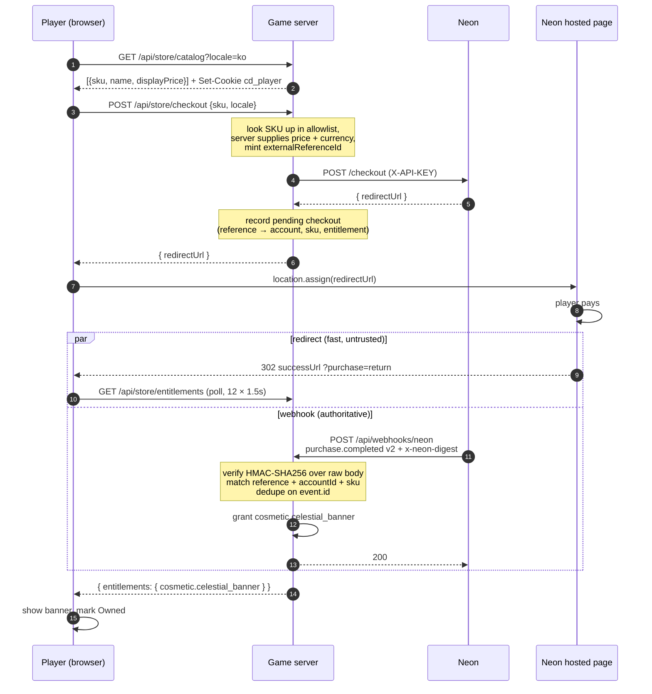
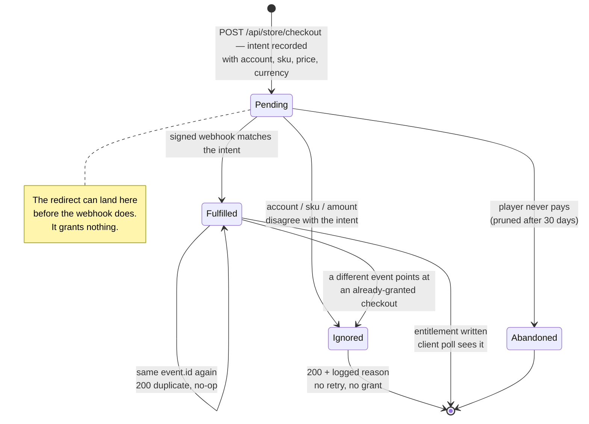

# 02 — Checkout flow

## Sequence

## The race this design exists to survive

Neon's documentation is explicit that the player can land on `successUrl` **before**
the `purchase.completed` webhook arrives. Any integration that grants the item on
the redirect is either wrong (grants without payment) or broken (shows nothing
after a real payment).

The resolution here is a strict split:

- The **redirect** is a UI event only. It opens the store modal and starts polling.
  It carries no authority — a player who types `?purchase=return` by hand gets a
  spinner and nothing else.
- The **webhook** is the only thing that writes an entitlement.
- The client polls `/api/store/entitlements` 12 times at 1.5s intervals (18s). If
  the webhook is slower than that, the entitlement still lands server-side and
  appears on the next page load. The purchase is never lost, only late.

## The life of one purchase

Every path a checkout intent can take. Only one of them grants anything, and the
ledger can name which state any purchase is in at any moment.

`Ignored` is a deliberate destination rather than an error path — see the response
codes below. Reaching it always leaves a log line saying why.

## Webhook verification, step by step

1. Read the **raw request bytes** — not a re-serialized object. The HMAC is over
   exactly what was sent, so parsing first and re-stringifying would break it.
2. `HMAC-SHA256(raw, NEON_WEBHOOK_SECRET)` in hex, compared to the `x-neon-digest`
   header with `timingSafeEqual` after a length guard (the guard is required —
   `timingSafeEqual` throws on unequal lengths). A failure here is the one case
   that answers non-2xx: `403`, because it means misconfiguration, not traffic.
3. **Shape**: `type === 'purchase.completed'`, `version === 2`,
   `data.purchase.status === 'complete'`, exactly one item, required ids present.
4. **Environment**: `isSandbox` must match `NEON_ENVIRONMENT`. A sandbox event must
   never be fulfilled against a production ledger, or the reverse.
5. **Intent**: the `externalReferenceId` must exist in the ledger, and its
   `accountId`, `sku`, quantity, and — when the settlement currency matches the one
   the checkout was created in — its **price** must agree. A webhook cannot credit
   an account that did not open that checkout, or credit it for less than it owes.
6. **Not already fulfilled**: a *different* event pointing at a checkout that has
   already been granted is refused, so double-fulfillment needs more than a new
   event id.
7. **Idempotency**: `processedEvents[event.id]`. Neon retries for up to 36 hours, so
   a duplicate delivery is normal traffic, not an error. The test asserts that two
   identical deliveries produce exactly one purchase record.

Steps 3–6 all resolve to `200 {ignored: reason}` with a log line: they can never
be fixed by retrying, and a non-2xx would buy 36 hours of pointless retries.
Storage failures still throw, and still return `5xx`, because those a retry *can*
fix.

## Configuration

`npm run serve` loads `.env` via Node's own `--env-file-if-exists`, so copying
`.env.example` to `.env` is enough — there is no dotenv dependency and no manual
exporting.

| Variable | Meaning |
|---|---|
| `NEON_MOCK_CHECKOUT` | `1` runs the whole flow locally with no Neon call. |
| `NEON_API_KEY` | Secret key, server-side only. |
| `NEON_WEBHOOK_SECRET` | Shared secret for the `x-neon-digest` HMAC. Without it every delivery is `403`. |
| `NEON_ENVIRONMENT` | `sandbox` (default) or `production`. Must agree with the `isSandbox` flag on incoming events. |
| `NEON_API_URL` | Defaults to `https://api.neonpay.com`. |
| `PUBLIC_URL` | Origin used to build `successUrl` / `cancelUrl` / `storeUrl`. **Leave it empty locally** — the server then uses the origin the request arrived on. Set it to the tunnel URL for sandbox testing. |

The server prints a warning at startup for each configuration that silently breaks
a checkout: no API key, no webhook secret, no `PUBLIC_URL` outside mock mode. It
warns again at checkout time if `PUBLIC_URL` disagrees with the origin the player
is actually on — see below.

## The origin trap

`successUrl` must land the player back on the **same origin they started from**.
`http://localhost:8642` and `http://127.0.0.1:8642` are different origins to a
browser, so a redirect that crosses between them drops the `cd_player` cookie, the
server mints a fresh account id on return, and fulfillment reports
`404 checkout not found` for a purchase that actually succeeded.

This was found by running the flow, not by reading the code. `PUBLIC_URL` now
defaults to the request's own origin, and a configured value that disagrees is
logged loudly. In a tunnelled sandbox the rule is simply: open the game at the
tunnel URL, never at localhost.

## Sandbox runbook

[07 — Sandbox checklist](07-sandbox-checklist.md) has the full sequence — Console
setup, tunnel, webhook registration, what to verify, and the negative tests worth
running once the happy path works. The short version:

1. Provision a sandbox API key in the Neon Console.
2. `cloudflared tunnel --url http://localhost:8642`.
3. Register `https://<tunnel>/api/webhooks/neon` for `purchase.completed` (v2) and
   copy the listener secret.
4. Put the key, the secret, and `PUBLIC_URL=https://<tunnel>` in `.env`.
5. Open the **tunnel URL** and buy the banner. Watch the server log for the
   webhook, then the badge appear.

## Mock mode

`NEON_MOCK_CHECKOUT=1` substitutes a local `redirectUrl` for Neon's. The return
page calls `/api/store/mock-complete`, which builds the same purchase record and
runs it through the **same** `repository.fulfill()` — same validation, same
idempotency, same entitlement write. The endpoint is registered only when mock
mode is on, and it refuses references that do not belong to the calling cookie.

This exists so the integration can be reviewed and demonstrated end-to-end without
credentials, and so the flow stays testable in CI.
