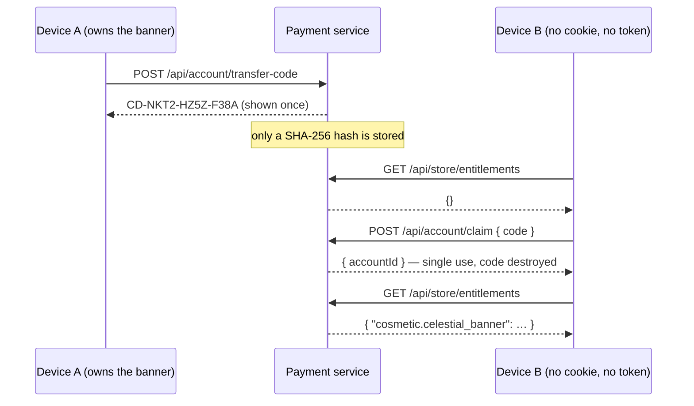

# 11 — Accounts and server saves

> Current implementation and verification limits: [12 — Review](12-review.md).

Up to here the integration had one honest weakness, and it was written down in
every document that touched identity: a player was a bearer credential bound to a
device. Clear the browser and the purchase is gone. Buy on a phone and the desktop
knows nothing about it.

That is the most common support ticket in game payments, and it is not a payments
bug — it is an identity gap. This closes it.

---

## Why transfer codes, and not email or OAuth

The obvious answer is email and password, or a social login. Both were rejected,
and the reason is worth stating because it is a scope judgement rather than a
technical one.

An account system is not one feature. Email means deliverability, verification,
reset flows, and a support path for people who lose access. OAuth means a provider
relationship and a consent screen. Either would have become the largest thing in
this repository, and neither would have demonstrated anything about **Neon**.

What actually needed proving is narrower: *a purchase follows an account rather
than a device*. A transfer code proves exactly that and nothing else.

It is also the convention this game's market already uses. Korean and Japanese
mobile titles have shipped 인계 코드 / 引き継ぎコード for years — players know to
write one down before switching phones. Borrowing a familiar mechanism is not a
shortcut here; it is the correct local answer.

**The honest caveat, stated in the code as well:** a transfer code is a transfer
mechanism, not authentication. Whoever holds the code holds the account. A real
title puts email or OAuth in this slot. What that changes is who can prove they
are the owner — not how entitlements are stored, which is the part this
demonstrates.

## What it looks like



Nothing is migrated. Device B does not receive a copy of anything — it simply
starts presenting the account id that already owned the entitlement. That is why
there is no merge logic and no window where a purchase exists twice.

## The four decisions inside it

**The code is stored as a hash, never in plaintext.** It is a bearer credential:
a leaked ledger file would otherwise hand over every account that had a code
outstanding. The plaintext leaves the server exactly once, in the response that
issues it.

**One live code per account.** Issuing a new one destroys the previous. Several
valid codes floating around would mean no way to revoke a code you regret writing
on a napkin.

**Single use, and a 24-hour expiry.** Both are enforced on claim, and the code is
deleted whether or not it turned out to be valid.

**A failed claim never says why.** Missing, expired and already-used all return
the same `404 invalid_code`. Distinguishing them tells someone guessing codes
which guesses were closer.

## Server saves, and the conflict nobody remembers to handle

An account is only useful if something is stored against it, so saves moved
server-side too — with a version rather than a timestamp:

```
GET  /api/save               → { save, version, updatedAt }
PUT  /api/save { save, baseVersion }
     → 200 { version }                        the write applied
     → 409 { error, version, save }           someone else wrote first
```

The `409` is the point. Two devices on one account is the whole reason accounts
exist, and last-write-wins quietly deletes whichever device was slower. Returning
the server's current copy alongside the conflict lets the client merge instead of
guess.

**What stays on the device:** graphics quality, reduced effects, key bindings,
language. Those belong to the machine a person is sitting at, not to the person.
The game's own storage module already drew that line in a comment — *"things that
belong to the device, not the run"* — and this keeps it.

## How it is verified

Both storage backends, same assertions:

- a code matches `CD-XXXX-XXXX-XXXX` and contains none of `O 0 I 1 L`, because a
  human retypes it on another device and ambiguous glyphs become support tickets;
- a device with no cookie and no token claims the code and **inherits the
  entitlement**;
- the same code a second time is refused;
- a nonsense code returns the same error as a used one;
- an empty account reads version 0;
- a write with a stale `baseVersion` is refused with `409` and the server's copy;
- a write on top of the current version succeeds and both devices then read it.

```
✅ JSON 원장:      … 환불 회수 · 계정 인계 · 저장본 · 실호출 경로
✅ Firestore 원장: … 환불 회수 · 계정 인계 · 저장본 · 실호출 경로
```

## Where this leaves the earlier caveats

Three documents said some version of "identity is a device-bound bearer
credential; a real title would use its own player id". That is now half true: the
account exists and purchases follow it. What remains is proving *who owns the
account*, which is the email/OAuth question above.

The guided tour was updated to match. It no longer claims the purchase is stuck to
the browser — it issues a code live and shows a second device inheriting the
banner, with `credentials: 'omit'` standing in for a device that has never been
here before.
