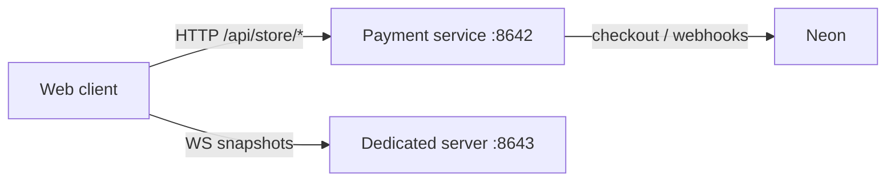
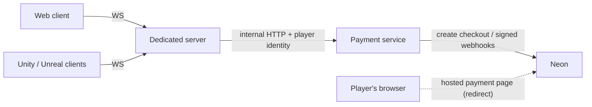

# 13 — Dedicated server: one authoritative process, many viewers

Added 2026-09-05. Source: `dedicated/` in
[constellation-defense](https://github.com/Hakhyun-Kim/constellation-defense);
wire contract in
[`dedicated/PROTOCOL.md`](https://github.com/Hakhyun-Kim/constellation-defense/blob/main/dedicated/PROTOCOL.md);
decision record in
[`docs/design/dedicated-server-architecture.md`](https://github.com/Hakhyun-Kim/constellation-defense/blob/main/docs/design/dedicated-server-architecture.md).

The game's simulation (`src/engine/`, `src/balance/`) was already pure — no
DOM, no renderer. The dedicated server runs that simulation authoritatively in
one Node process and broadcasts it; every client is a renderer of its
snapshots. The web build joins with `?dedicated=1`; the `clients/` directory
carries Unity and Unreal protocol smoke tests written to the same contract.
No game rule runs client-side in this mode.

## Run it

Requires Node 22.9+. From a `constellation-defense` checkout:

- **Windows** — double-click `start-dedicated.bat`
- **macOS / Linux** — `./start-dedicated.command`

Either starts the dedicated server (`ws://127.0.0.1:8643`) and the web client
(`http://127.0.0.1:8642`), then opens the live viewer. A server-side bot plays
immediately; the on-screen panel shows the architecture, command flow, code
map and progress, and a **Try the game** button switches to an ordinary local
client-mode run.

Manual equivalent:

```bash
npm run dedicated     # terminal 1 — ws://127.0.0.1:8643
npm run serve         # terminal 2 — http://127.0.0.1:8642
# then open http://127.0.0.1:8642/?lang=en&dedicated=1
```

Watching is public. Session control (`pause`, `speed`, `restart`) requires the
controller key printed at server boot (`DEDICATED_CONTROL_KEY`; the launchers
pin `local-demo-key` for loopback and pass it in the viewer URL as `&key=…`).
A wrong key is downgraded to viewer with a visible reason, not disconnected.
A `compose.yaml` / `dedicated/Dockerfile` container path exists for
deployment-shaped review; it has not been executed on the development machine,
and the plain-Node launchers remain the supported path.

## Verify

`npm run dedicated:check` runs inside the main `npm run check` gate and is the
executable form of the protocol: RFC 6455 handshake vector, frame length
encodings, health endpoint, viewer welcome and snapshot schema, autonomous
progress into combat, event/decision streaming, tick advancement, viewer
command refusal, wrong-key downgrade, controller speed/pause/restart with
invalid-input rejection, and restart announcement to every client. It passes
in CI on Linux and locally on Windows; a manual browser pass covered the live
viewer, the role badge and denial path, speed-up with the key, switching to a
local game and rejoining the same server session, with an empty console.

## Design in one paragraph

Snapshots, not lockstep. A command-replay mirror was rejected for reasons
recorded in the decision document: the tactic board and engine share one rng
stream consumed inside animation timers, browser engines differ in float
bit-patterns, and saves intentionally exist only at preparation boundaries.
So the server streams full render state (20 Hz in combat, 2 Hz otherwise)
plus engine events and a decision narration; clients merge and interpolate.
The transport is a dependency-free WebSocket endpoint; roles are assigned at
`hello`.

## Payment topology — today, and the direction

Today the dedicated server carries the simulation only. The web client speaks
to two services:



The intended direction is for the dedicated server to become **the only
client-facing edge**: clients hold one connection and one identity, and the
dedicated server brokers store operations to the payment service
server-to-server:



Why this is worth doing:

- **Adding a payment feature becomes a server-side change.** A new SKU or a
  new flow lands in the payment service and the dedicated protocol; every
  engine client just renders new catalog/entitlement data from the stream it
  already has — no HTTP store client, cookies or CSP work per engine.
- **Entitlements join the authoritative state.** A purchase lands in the
  simulation the server owns, so every viewer sees the cosmetic appear from
  the same snapshot — matching the rule that only the server's numbers are
  the numbers.
- **One identity.** The dedicated session becomes the identity clients prove
  once; the server maps it to the payment service's bearer identity instead
  of each client managing its own.

Two boundaries survive the change deliberately. The payment service stays a
separate process behind the dedicated server rather than being absorbed into
it: webhook delivery (retried up to 36 hours) must not depend on game-session
lifecycle, and payment credentials stay out of the game-server process. And
Hosted checkout still opens Neon's payment page in the player's browser —
"clients talk only to the dedicated server" applies to API traffic, not to
the hosted page redirect that is the point of Hosted checkout.

**Status, honestly:** this is the designed next milestone, not the shipped
state. What exists today and is verified: the role/auth handshake, the
command/`commandResult` request path the store calls would reuse, snapshot
broadcasting, and the payment service's bearer identity — the pieces the
migration composes. The store messages themselves (`catalog`,
`checkoutIntent`, entitlement pushes) are not yet in the protocol.
