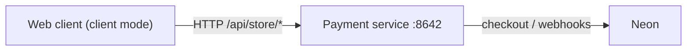

# 13 — Dedicated server: one authoritative process, many viewers

Added 2026-09-05. Source: `dedicated/` in
[constellation-defense](https://github.com/Hakhyun-Kim/constellation-defense);
wire contract in
[`dedicated/PROTOCOL.md`](https://github.com/Hakhyun-Kim/constellation-defense/blob/main/dedicated/PROTOCOL.md);
decision record in
[`docs/design/dedicated-server-architecture.md`](https://github.com/Hakhyun-Kim/constellation-defense/blob/main/docs/design/dedicated-server-architecture.md).

The game's simulation (`src/engine/`, `src/balance/`) was already pure — no
DOM, no renderer. The dedicated server runs that simulation authoritatively in
one Node process and broadcasts it; every client is a renderer of its
snapshots. The web build joins with `?dedicated=1`; the `clients/` directory
carries Unity and Unreal protocol smoke tests written to the same contract.
No game rule runs client-side in this mode.

## What exists today, precisely (2026-09-06 review)

"Dedicated server" normally means a process that simulates the *players'*
inputs and that engine clients render as a scene. This build is not there
yet, and the word should be read narrowly:

| Usually expected | This build, now | Where in the game repo |
|---|---|---|
| Server simulates what players do | The server simulates what **its own bot** does; no client input reaches the engine | `dedicated/host.mjs` (drives `src/bot.js`) |
| Clients send game actions | Client→server messages are `hello`, `ping`, `command` (`pause`/`resume`/`speed`/`restart`) and `store` only | `dedicated/PROTOCOL.md` |
| "Play" happens through the server | **Try the game** disconnects and starts a local client-mode game | `src/main.js` (`onTryGame`) |
| Unity/Unreal clients render the session | `clients/` holds protocol smoke tests (connect, `welcome`, snapshot fields, forbidden `command`, `store` catalog); nothing renders, and neither file has been executed in an engine | `clients/README.md` |
| Hosted checkout returns to the server-mode view | A hosted (non-mock) return lands on the client-mode URL | `server/store-api.mjs` (`successUrl`) |

What is real and gated by `npm run dedicated:check`: one authoritative
simulation broadcasting snapshots/events/decisions, key-authenticated
session control, and the store gateway (catalog, checkout, fulfil, refund,
shared cosmetics) against a real in-process payment service. So, today: a
**server-authoritative spectator broadcast plus a store gateway** — the
payment topology below is shipped, the multiplayer sense of "dedicated" is
not.

Next, in order, with what each needs:

1. **Player input through the server** — a client→server game-action
   message in `PROTOCOL.md`, the host gating its bot decision behind the
   controller's intent, validation against the same engine commands, and a
   conformance case in `scripts/dedicated-check.mjs`.
2. **An engine viewer** — Unity or Unreal rendering `snapshot.enemies` /
   `snapshot.field` into a scene keyed on entity ids and mapping `decision`
   to captions, executed inside the engine at least once.
3. **Gateway-mode hosted return** — `successUrl` carrying `?dedicated=1`
   (and the key) so a real Neon return rejoins the server view.

## Run it

Requires Node 22.9+. From a `constellation-defense` checkout:

- **Windows** — double-click `start-dedicated.bat`
- **macOS / Linux** — `./start-dedicated.command`

Either starts the dedicated server (`ws://127.0.0.1:8643`) and the web client
(`http://127.0.0.1:8642`), then opens the live viewer. A server-side bot plays
immediately; the on-screen panel shows the architecture, command flow, code
map and progress, a **Store — through this server** button that opens the real
store over the gateway (mock mode, no credentials; delivered cosmetics appear
on the shared castle for every viewer), and a **Try the game** button that
switches to an ordinary local client-mode run.

Manual equivalent:

```bash
npm run dedicated     # terminal 1 — ws://127.0.0.1:8643
npm run serve         # terminal 2 — http://127.0.0.1:8642
# then open http://127.0.0.1:8642/?lang=en&dedicated=1
```

Watching is public. Session control (`pause`, `speed`, `restart`) requires the
controller key printed at server boot (`DEDICATED_CONTROL_KEY`; the launchers
pin `local-demo-key` for loopback and pass it in the viewer URL as `&key=…`).
A wrong key is downgraded to viewer with a visible reason, not disconnected.
A `compose.yaml` / `dedicated/Dockerfile` container path exists for
deployment-shaped review; it has not been executed on the development machine,
and the plain-Node launchers remain the supported path.

## Verify

`npm run dedicated:check` runs inside the main `npm run check` gate and is the
executable form of the protocol: RFC 6455 handshake vector, frame length
encodings, health endpoint, viewer welcome and snapshot schema, autonomous
progress into combat, event/decision streaming, tick advancement, viewer
command refusal, wrong-key downgrade, controller speed/pause/restart with
invalid-input rejection, and restart announcement to every client. The
gateway suite boots a **real in-process payment service** (mock mode,
temporary JSON ledger) behind the server and asserts: catalog forwarding,
minted-identity announcement, supplied-identity continuity, market selection
through the cookie jar, brokered checkout → fulfilment → refund, the
delivered cosmetic appearing in — and after refund disappearing from —
another viewer's snapshots, webhook paths refused with a written reason, and
non-store paths refused. 29 assertions, green in CI on Linux and locally on
Windows.

Manual browser passes covered the live viewer, the role badge and denial
path, speed-up with the key, switching to a local game and rejoining the
same server session — and the store: a cosmetic bought and refunded through
the panel's store button, with a second keyless viewer tab gaining and
losing the shared castle decoration, consoles empty throughout.

## Design in one paragraph

Snapshots, not lockstep. A command-replay mirror was rejected for reasons
recorded in the decision document: the tactic board and engine share one rng
stream consumed inside animation timers, browser engines differ in float
bit-patterns, and saves intentionally exist only at preparation boundaries.
So the server streams full render state (20 Hz in combat, 2 Hz otherwise)
plus engine events and a decision narration; clients merge and interpolate.
The transport is a dependency-free WebSocket endpoint; roles are assigned at
`hello`.

## Payment topology — one socket per client (shipped, protocol v2)

In **client mode** the game talks to the payment service directly over HTTP,
as documented throughout docs 00–12:



In **server mode** the dedicated server is the only client-facing edge:
clients hold one connection and one identity, and the server brokers store
operations to the payment service server-to-server:

```mermaid
flowchart LR
    W["Web viewer"] -- "WS · snapshots + store" --> D["Dedicated server + gateway"]
    U["Unity / Unreal clients"] -- WS --> D
    D -- "Bearer identity + cookie jar" --> P["Payment service"]
    P -- "create checkout / signed webhooks" --> N["Neon"]
    B["Player&#39;s browser"] -. "hosted payment page (redirect)" .-> N
```



What this buys, now demonstrated rather than promised:

- **A payment feature is a server-side change.** The store UI did not change
  when the wire did — it swaps one injected transport function. An engine
  client needs no HTTP store client, cookies or payment-origin CSP work; the
  Unity/Unreal samples assert a brokered catalog on the socket they already
  hold.
- **Entitlements join the authoritative state.** After a brokered fulfilment
  or refund the gateway re-reads that account's entitlements from the ledger
  and broadcasts the union in every snapshot (`cosmetics`): buy a decoration
  from the viewer panel and every watching client's castle wears it; refund
  it and it disappears for everyone.
- **One identity.** The connection's account is the `playerToken` from
  `hello` (the same bearer identity client mode persists) or a minted UUID,
  announced back in `storeIdentity`; a claimed transfer code switches the
  connection's account. The gateway's per-connection cookie jar also makes
  explicit market selection work for cookie-less clients — closing a
  limitation docs/12 records for cross-origin callers.

Two boundaries survive on purpose. The payment service stays a separate
process behind the gateway — webhook delivery (retried up to 36 hours) must
not depend on game-session lifecycle, and payment credentials stay out of
the game-server process; the gateway forwards an **allowlisted store surface
only** and refuses `/api/webhooks/*` with a written reason. And Hosted
checkout still opens Neon's payment page in the player's browser — "one
socket" applies to API traffic, not to the redirect that is the point of
Hosted checkout. A hosted-mode return currently lands on the client-mode
URL; gateway-mode return routing is the recorded next seam, and the
credential-free mock lifecycle runs entirely in-modal. The `U` node in the
target diagram above is aspirational: today it is a smoke test, not a
viewer (see the table at the top of this page).
