# 15 — 전체 흐름 그림으로 보기 (한국어)

이 문서는 **그림 중심의 한국어 설명서**입니다. 00–14번 영문 문서가 각 주제를 깊게
다룬다면, 이 문서는 "결제 버튼을 누르면 무슨 일이 벌어지는가"를 처음부터 끝까지
한 번에 따라갈 수 있게 만든 것입니다.

특히 자주 묻는 세 가지를 그림으로 답합니다.

1. **Hosted Checkout이 어떻게 내 화면에 나타나는가**
2. **웹훅이 리다이렉트보다 늦게 오면 화면은 어떻게 되는가**
3. **실패했을 때 서버는 어떤 응답 코드를 돌려주는가, 그리고 왜 그런가**

코드는 모두 [constellation-defense](https://github.com/Hakhyun-Kim/constellation-defense)에
있습니다. 파일 경로와 줄 번호는 `main` 기준입니다.

---

## 1. 30초 요약

> 브라우저는 **SKU와 표시 언어만** 보냅니다. 가격·통화·국가는 서버가 정합니다.
> 결제창은 Neon이 호스팅하는 페이지로 **브라우저가 통째로 이동**해서 봅니다.
> 아이템을 지급하는 것은 오직 **서명된 웹훅** 하나뿐입니다.
> 결제 후 돌아오는 주소(`successUrl`)는 아무 권한이 없고, 화면을 "확인 중"으로
> 바꾸고 폴링을 시작하는 신호일 뿐입니다.

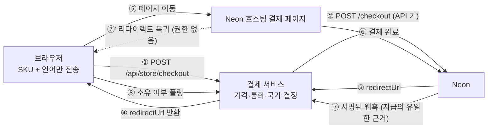

---

## 2. 등장인물과 신뢰 경계

무엇을 믿고 무엇을 믿지 않는지가 이 통합의 뼈대입니다.

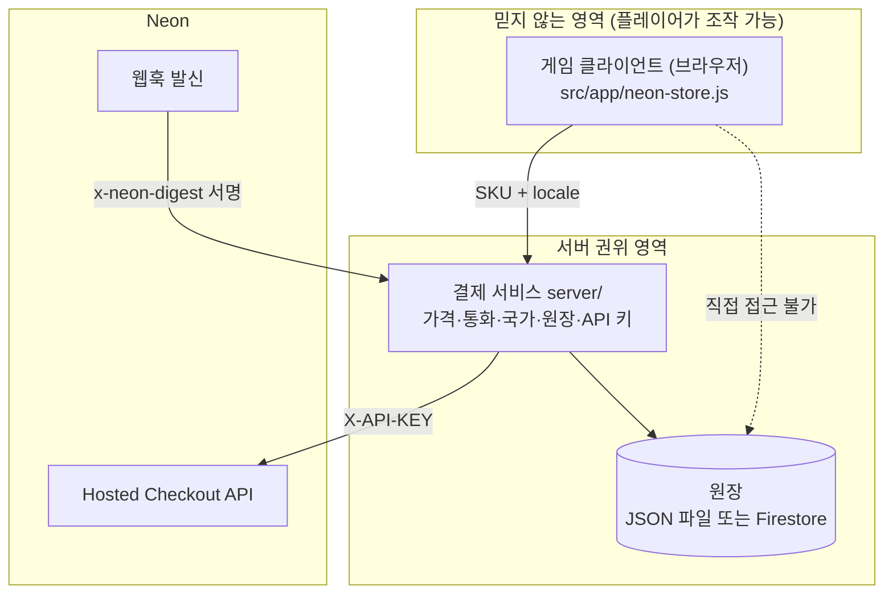

| 항목 | 어디에 있나 | 왜 |
|---|---|---|
| Neon API 키 | 서버 프로세스 환경변수 (배포는 Secret Manager) | 번들에 들어가면 누구나 결제를 만들 수 있음 |
| 가격·통화 | `server/catalog.mjs`의 동결된 표 | 브라우저가 보낸 가격은 **무시**됨 |
| 청구 국가 | 서버가 요청 신호로 결정 | Neon이 통화를 `playerCountry`에 맞추므로 |
| 소유 기록 | 서버 원장 | devtools로 고칠 수 있는 플래그는 소유가 아님 |
| 지급 권한 | 서명 검증을 통과한 웹훅만 | 리다이렉트는 위조 가능 |

---

## 3. 구매 흐름 — 8단계 상세

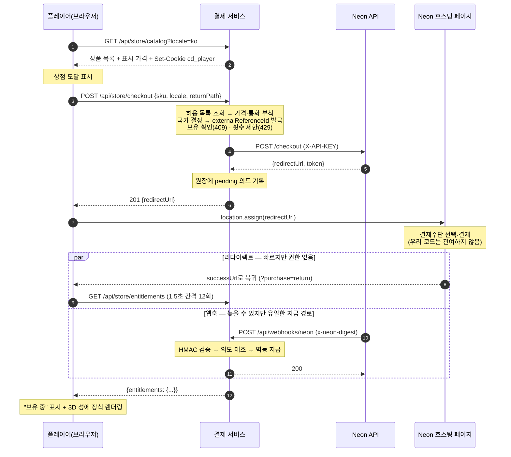

### 단계별로 무엇을 하는가

| 단계 | 하는 일 | 코드 위치 |
|---|---|---|
| ① 카탈로그 | 국가에 맞는 통화로 상품·표시 가격 반환, 신원 쿠키 발급 | `server/store-api.mjs:212` |
| ② 요청 | 클라이언트가 **SKU·locale·returnPath**만 전송 | `src/app/neon-store.js:387` |
| ③ 가격 부착 | 허용 목록에서 가격·통화를 서버가 붙임 | `server/catalog.mjs` |
| ④ 사전 거절 | 이미 보유 시 `409`, 10분 내 10회 초과 시 `429` | `server/store-api.mjs:292` |
| ⑤ Neon 호출 | `POST /checkout`, 10초 타임아웃, `https://` 검증 | `server/neon-client.mjs:3` |
| ⑥ 의도 기록 | `externalReferenceId → 계정·SKU·가격·통화·국가`를 `pending`으로 저장 | `server/repository.mjs` |
| ⑦ 이동 | `location.assign(redirectUrl)` — 탭이 Neon 도메인으로 바뀜 | `src/app/neon-store.js:411` |
| ⑧ 복귀·폴링 | `?purchase=return` 감지 → 모달 열고 폴링 시작 | `src/app/neon-store.js:306` |

### 클라이언트가 보내는 것과 보내지 않는 것

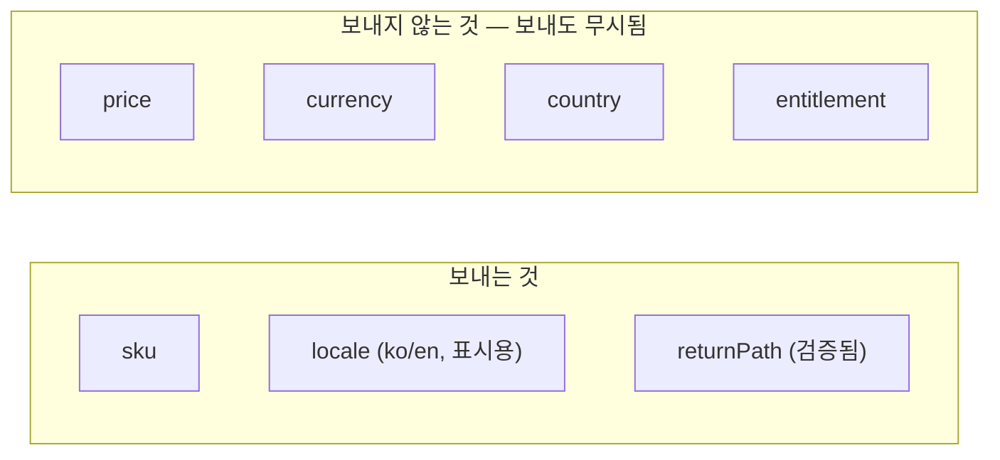

테스트가 일부러 `price: 1, country: 'US', currency: 'USD'`를 함께 보내고,
서버가 전부 무시하는지 검증합니다(`scripts/store-server-check.mjs`).

---

## 4. 왜 "Hosted"인가 — 결제창은 우리가 그리지 않는다

가장 많이 오해하는 지점입니다. 결제 UI는 iframe도 팝업도 아닙니다.

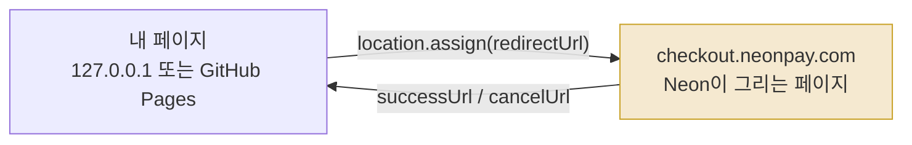

- 카드 입력과 결제수단 선택, 인증 절차는 **전부 Neon 페이지 안**에서 일어납니다.
- 우리 코드는 그 페이지에 접근할 수 없고, 접근할 필요도 없습니다. 카드 정보가
  우리 서버와 번들을 지나가지 않는 것이 Hosted Checkout을 쓰는 이유입니다.
- 그래서 "클라이언트는 서버하고만 통신한다"는 원칙에도 **이 리다이렉트만은 예외**입니다.

돌아올 주소는 서버가 만듭니다.

```
successUrl = <오리진><returnPath>?<보존된 파라미터>&lang=ko&purchase=return&sku=...&api=...
cancelUrl  = ... &purchase=cancelled&sku=...
```

오리진은 ①허용 목록에 있는 요청 Origin + 검증된 returnPath ②`PUBLIC_URL`
③요청 오리진 순으로 정해집니다. `localhost`와 `127.0.0.1`은 브라우저에게 서로 다른
오리진이라, 여기가 어긋나면 결제는 성공했는데 세션 쿠키를 잃어 "구매했는데 소유가
안 보이는" 상태가 됩니다. 실제로 겪었고 고친 버그입니다.

---

## 5. 핵심 ① — 리다이렉트는 권한이 없다

Neon 문서는 `successUrl` 복귀가 `purchase.completed` 웹훅보다 **먼저 도착할 수 있다**고
명시합니다. 두 경우를 모두 견뎌야 합니다.

**경우 A — 웹훅이 먼저 (흔함)**

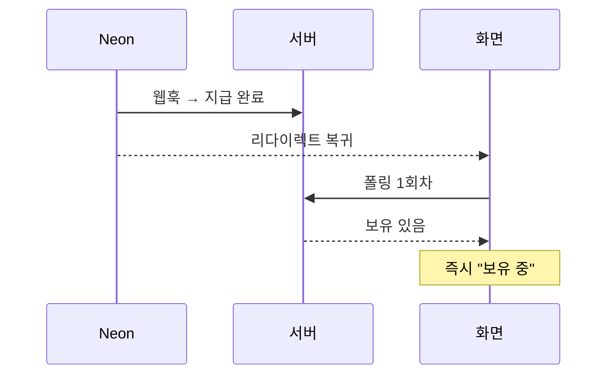

**경우 B — 리다이렉트가 먼저 (설계가 존재하는 이유)**

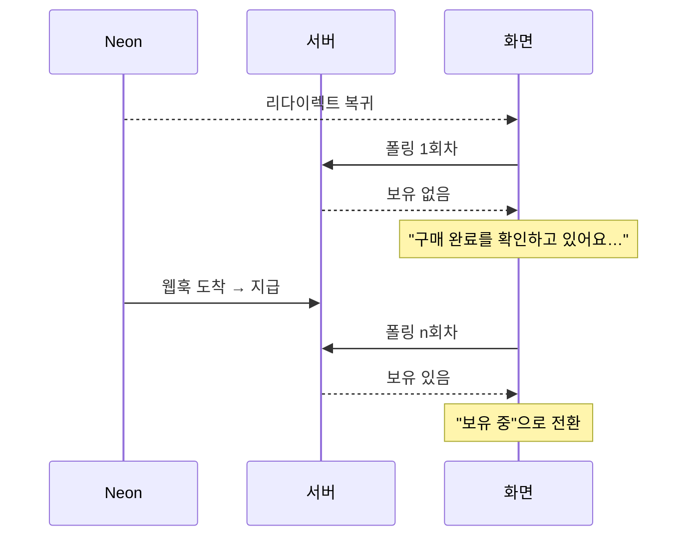

만약 리다이렉트로 지급했다면 두 가지 중 하나가 됩니다.

- **틀림** — 주소창에 `?purchase=return`만 쳐도 아이템이 생김
- **깨짐** — 실제 결제 후에도 아무것도 안 보임

그래서 복귀 주소는 **UI 신호**로만 씁니다. 직접 주소를 입력하면 폴링만 돌다가
"다시 확인" 버튼이 남습니다. 지급은 일어나지 않습니다.

---

## 6. 화면은 어떻게 바뀌나 — 클라이언트 상태

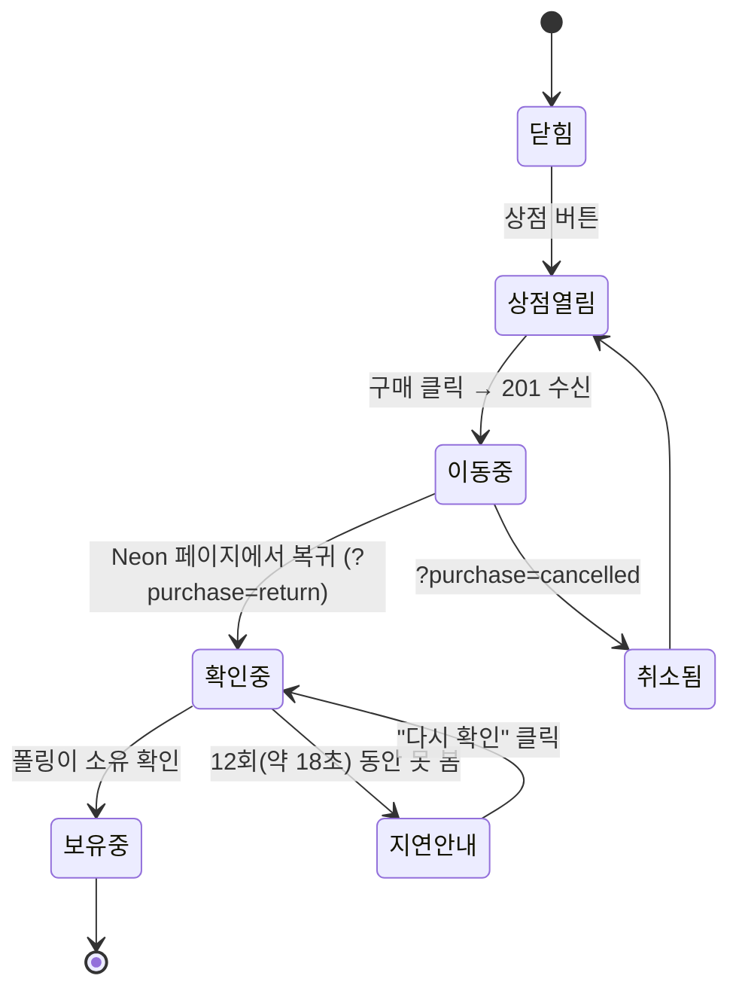

| 상태 | 화면 문구 | 내부 동작 |
|---|---|---|
| 확인중 | "구매 완료를 확인하고 있어요…" | `GET /api/store/entitlements` 1.5초 × 12회 |
| 보유중 | "보유 중" + 버튼 비활성 | 3D 성에 장식 렌더링 |
| 지연안내 | "확인이 평소보다 늦어지고 있어요. 구매는 안전하게 기록돼 있어요." | **다시 확인** 버튼 노출 |
| 취소됨 | "결제가 취소되었습니다. 복귀 주소로 지급되지 않습니다." | 아무 변화 없음 |

**18초가 지나도 잃지 않습니다.** 웹훅은 클라이언트와 무관하게 서버 원장에
기록되므로, 창을 닫았다가 다시 열면 `refreshEntitlements()`가 바로 "보유 중"을
그립니다. 늦을 뿐 사라지지 않습니다.

---

## 7. 핵심 ② — 웹훅 검증과 응답 코드

여기가 이 통합에서 가장 중요한 부분입니다. **Neon은 2xx가 아닌 응답을 최대 36시간
재시도합니다.** 그래서 "재시도로 고칠 수 있는가"가 응답 코드를 가릅니다.

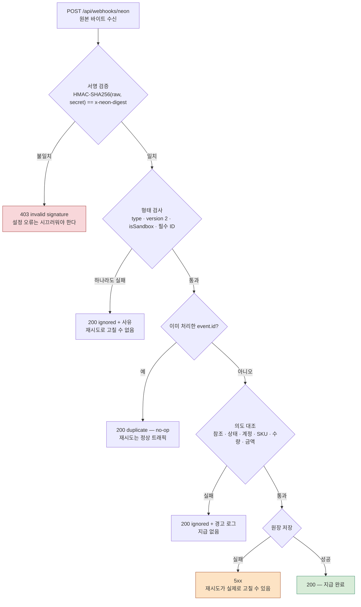

### 응답 코드 표 — 왜 그 코드인가

| 상황 | 응답 | 이유 |
|---|---|---|
| 서명 불일치 | **403** | 재시도해도 안 고쳐지지만, **설정 오류**라서 조용하면 안 됨. 유일한 비-2xx 거절 |
| 처리하지 않는 이벤트 종류 | **200** `{ignored}` | 우리가 안 쓰는 이벤트. 400을 주면 36시간 헛된 재시도를 삼 |
| 버전 불일치 / 환경 불일치 | **200** `{ignored}` | 영구 조건. 재시도 무의미 |
| 모르는 `externalReferenceId` | **200** `{ignored}` | 우리 원장에 없는 결제. 재시도해도 생기지 않음 |
| 계정·SKU·금액 불일치 | **200** `{ignored}` + 경고 로그 | 지급하면 안 되고, 재시도로 바뀌지도 않음 |
| 같은 `event.id` 재전송 | **200** `{duplicate}` | Neon 재시도는 **정상 트래픽**. 멱등 no-op |
| 원장 저장 실패 | **5xx** | 디스크·네트워크 일시 장애. **재시도가 실제로 고칠 수 있음** |
| Neon `POST /checkout` 실패 | **502** | 상류 장애를 그대로 알림 (`server/neon-client.mjs`) |
| 본문 크기 초과 (상점 64KiB · 세이브 256KiB) | **413** | 입력 방어 |
| 잘못된 JSON 본문 (일반 API) | **400** | 클라이언트 오류 |

> **한 줄 요약:** 재시도가 고칠 수 있으면 5xx, 못 고치면 200에 사유를 담아 삼키고,
> 서명 실패만 403으로 시끄럽게 남긴다.

이건 코드만 봐서는 보이지 않는 결함입니다. "처리 못 하는 이벤트에 400" 은 교과서적으로
맞지만 Neon의 재시도 정책과 만나면 틀린 코드가 됩니다. 벤더 문서를 읽어야만
드러나는 종류의 버그입니다.

### 검증 순서 (코드 기준)

1. **원본 바이트**로 HMAC 계산 — 파싱 후 재직렬화하면 서명이 깨집니다.
2. 길이 확인 후 `timingSafeEqual` — 길이가 다르면 이 함수는 예외를 던집니다.
3. 형태 검사 → 환경 검사 → 의도 대조 → 멱등 검사 순.

관련 코드: `server/store-api.mjs:120` (`verifyWebhook`), `:129` (`classifyEvent`),
`server/repository.mjs:80` (`fulfill`).

---

## 8. 결제 의도의 일생

원장은 모든 결제가 지금 어느 상태인지 이름을 댈 수 있습니다.

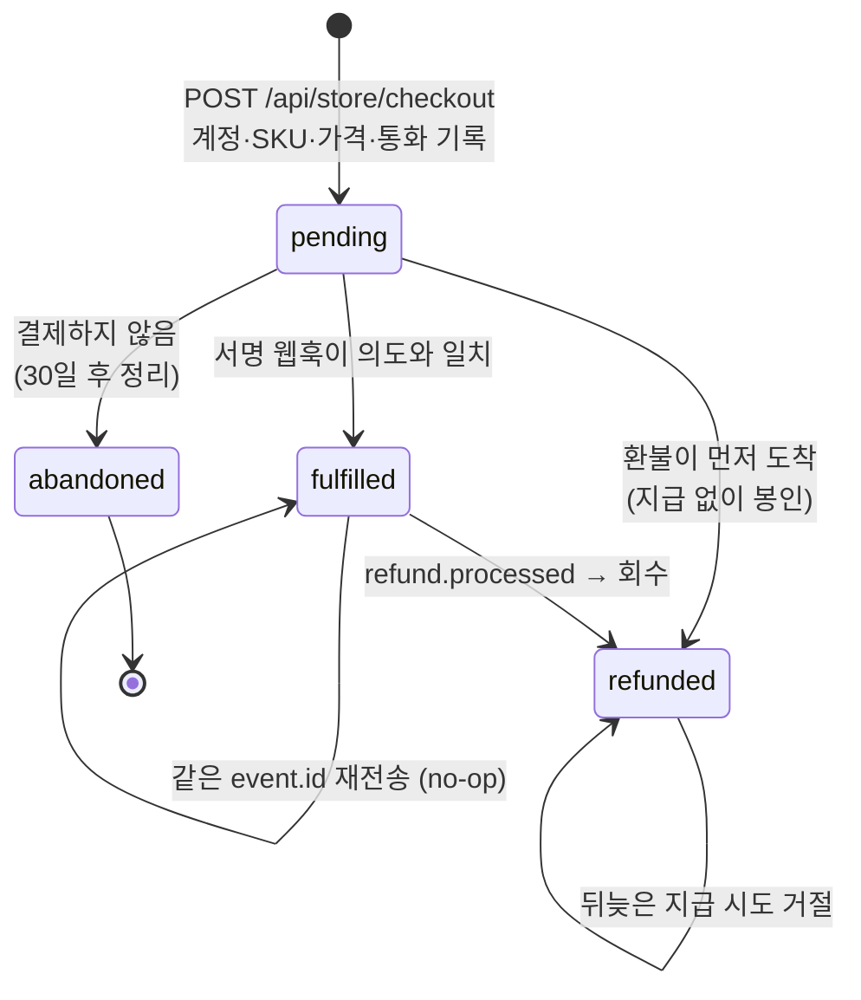

핵심 방어 두 가지입니다.

- **뒤늦은 지급이 환불을 되살리지 못함** — `pending`이 아닌 의도에 대한 지급 시도는
  거절됩니다.
- **구매보다 먼저 온 환불** — 매핑이 아직 없으면 `purchaseId`로 보관해 두었다가,
  나중에 도착한 지급을 막습니다(`deferred`).

---

## 9. 환불 흐름

환불도 **요청과 회수가 분리**되어 있습니다. 요청은 API가, 회수는 웹훅이 합니다.

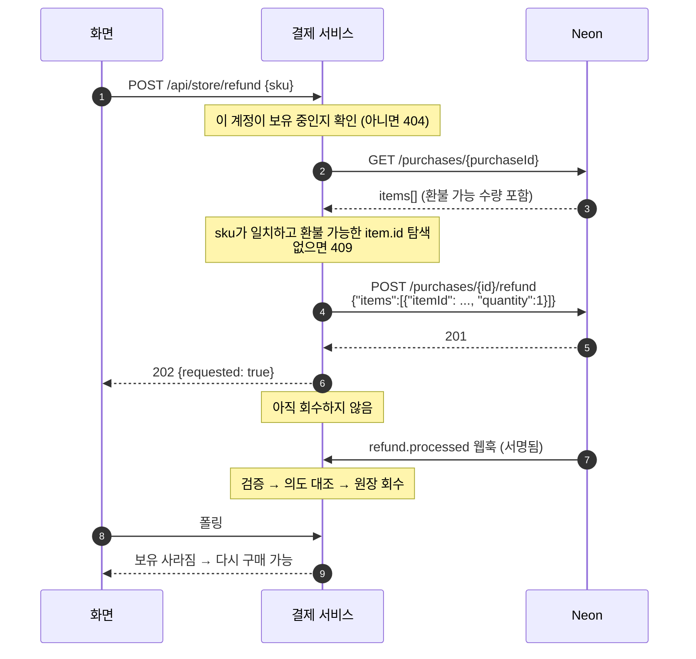

**샌드박스에서 발견한 벤더 이슈:** 본문 없이(`{}`) 전체 환불을 요청하면 500이
돌아옵니다. item 단위 본문은 201로 정상 동작합니다. 또 구매 응답은 필드명이
`items[].id`인데 환불 요청은 `itemId`를 받습니다. 재현 절차는
[09](09-sandbox-run.md) 부록에 있습니다.

---

## 10. 핵심 ③ — 국가는 언어가 아니다

Neon은 통화를 `playerCountry`에 강제로 맞춥니다. 그래서 게임의 ko/en 토글로 국가를
정하면, 한국어로 게임하는 미국 사용자에게 KRW를, 영어로 게임하는 한국 사용자에게
USD를 물릴 수 있습니다. 세금 관할과 결제수단이 전부 틀어집니다.

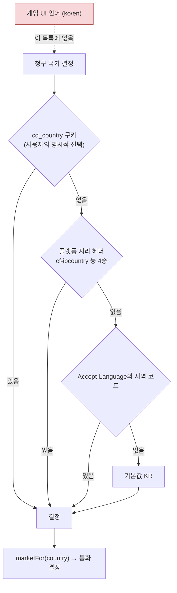

`locale`은 오직 **표시**에만 씁니다. 이 규칙에는 회귀 테스트가 붙어 있습니다.
코드: `server/store-api.mjs:65` (`resolveCountry`).

---

## 11. 핵심 ④ — 원화 100배 표기

Neon은 가격을 **기본 단위의 100배 정수**로 받습니다. 원화는 보조 단위가 없어서
₩4,900이 `490000`으로 나갑니다. 한국 개발자 눈에는 자릿수 오류처럼 보이는 값이라
100배 실수가 나기 딱 좋은 지점입니다.

| 표시 | Neon에 보내는 값 | 계산 |
|---|---|---|
| ₩4,900 | `490000` | 4900 × 100 |
| ₩3,900 | `390000` | 3900 × 100 |
| ₩5,900 | `590000` | 5900 × 100 |
| $4.99 | `499` | 4.99 × 100 |

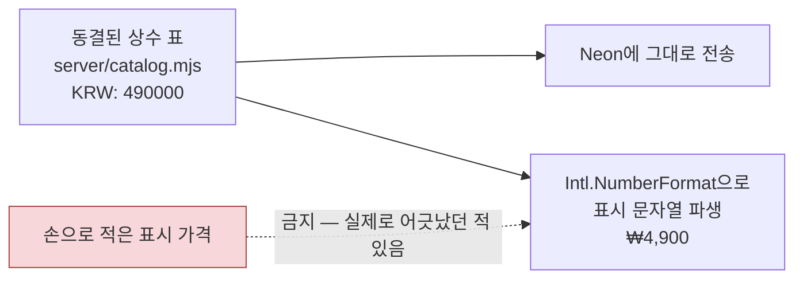

배수는 상수 표 **한 곳**에만 두고 표시 문자열은 항상 파생시킵니다. 과거에 하드코딩한
표시 가격이 실제 결제 금액과 어긋난 적이 있어서 만든 규칙입니다.

---

## 12. 실패하면 어떻게 되나

| 실패 | 플레이어가 보는 것 | 서버 동작 |
|---|---|---|
| 결제 서비스가 꺼져 있음 | 상점 버튼이 조용히 사라짐 | 정적 배포(GitHub Pages)에서는 정상 동작 |
| Neon `POST /checkout` 실패 | "상점을 잠시 이용할 수 없어요" | 502 반환, 의도 기록 없음 |
| 결제는 됐는데 웹훅이 늦음 | "확인 중" → "다시 확인" 버튼 | 원장은 여전히 `pending`, 도착 시 지급 |
| 웹훅 도착했는데 저장 실패 | 계속 "확인 중" | **5xx** 반환 → Neon이 재시도 → 복구 |
| 같은 웹훅 재전송 | 변화 없음 | `event.id` 멱등 no-op |
| 위조된 웹훅 | 변화 없음 | **403**, 경고 로그 |
| 금액·계정 위조 | 변화 없음 | 200 `{ignored}` + 사유 로그, 지급 없음 |
| 주소창에 `?purchase=return` 직접 입력 | 폴링 후 "다시 확인" | 아무 일도 없음 |
| 이미 보유한 상품 재구매 | 버튼 비활성 | 서버도 **409**로 재차 거절 |
| 짧은 시간에 반복 시도 | 오류 문구 | 10분 10회 초과 시 **429** |

**아직 열려 있는 한계도 같이 적어 둡니다.**

- 동시에 두 개의 `pending` 체크아웃을 만들면 둘 다 결제될 수 있습니다. 보유 검사는
  entitlement가 생긴 뒤에만 막습니다. 원자적 예약은 미구현입니다.
- 플레이어 신원은 **인증 없는 bearer UUID**입니다. 실제 타이틀이라면 자체 인증
  체계를 여기에 연결해야 합니다. 자세한 내용은 [08](08-storage-and-identity.md).

---

## 13. 서버 모드(상점 게이트웨이)는 무엇이 다른가

과제 범위 밖의 향후 작업용 토대입니다. 결제 흐름 자체는 동일하고, **상점 호출이
지나가는 길만** 달라집니다.

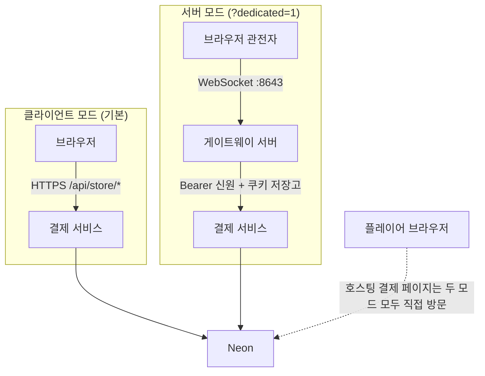

- 게이트웨이는 **허용 목록에 있는 상점 경로만** 중계합니다. `/api/webhooks/*`는
  "클라이언트가 지나갈 경로가 아니다"라는 사유와 함께 403으로 거절합니다.
  웹훅은 Neon → 결제 서비스 직통 트래픽입니다.
- 제한: 연결당 동시 4건, 본문 64KiB, 상류 10초.
- 결제 서비스를 게이트웨이 뒤 **별도 프로세스**로 둔 이유는 두 가지입니다.
  36시간 재시도되는 웹훅 수신이 게임 세션 수명에 묶이면 안 되고, 결제 키가 게임
  서버 프로세스에 들어가면 안 됩니다.
- 지금 이 모드는 서버가 봇 정책으로 혼자 플레이하는 **관전 방송**입니다. 프로토콜에
  플레이어 행동 메시지가 없고, Unity/Unreal 파일은 뷰어가 아니라 프로토콜 스모크
  테스트입니다. 자세한 범위는 [13](13-dedicated-server.md).

---

## 14. 직접 확인해 보기

자격 증명 없이 전체 수명주기를 재현할 수 있습니다.

```bash
git clone https://github.com/Hakhyun-Kim/constellation-defense
cd constellation-defense
npm install && npm run build
cp .env.example .env      # NEON_MOCK_CHECKOUT=1 이 이미 켜져 있음
npm run serve
```

| 보고 싶은 것 | 방법 |
|---|---|
| 5단계 인스펙터 + 실제 상점 | `http://127.0.0.1:8642/?lang=ko&demo=고수&tour=neon&mute` |
| 상점만 바로 | `http://127.0.0.1:8642/?lang=ko&store=1` |
| 리다이렉트가 지급하지 않음 | 주소창에 `?purchase=return`을 직접 입력 |
| 위조 웹훅이 403 | 인스펙터의 위조 웹훅 버튼 |
| 계약 검증 | `npm run store:check` · `npm run dedicated:check` |

모의 모드는 Neon을 호출하지 않을 뿐, **같은 원장과 같은 멱등 지급 경로**를 씁니다.
구매 상태는 새로고침해도 유지되며 Test refund 또는 `.data/` 삭제로 초기화합니다.

---

## 15. 코드 위치 요약

| 파일 | 역할 |
|---|---|
| `server/store-api.mjs` | 라우트 · 신원 · 국가 해석 · 웹훅 검증/분류 · 환불 요청 |
| `server/catalog.mjs` | SKU 허용 목록 · 시장 표 · 서버 소유 가격 · `Intl` 표시 |
| `server/repository.mjs` · `firestore-repository.mjs` | 원장 두 구현 · 멱등 지급/회수 · 환불 선착 처리 |
| `server/neon-client.mjs` | Neon HTTP 어댑터 (체크아웃 생성 · 구매 조회 · item 단위 환불) |
| `server/index.mjs` | 독립 결제 서비스 진입점 (Cloud Run) |
| `src/app/neon-store.js` | 상점 UI · 체크아웃 시작 · 복귀 폴링 · 환불 |
| `dedicated/server.mjs` | 게이트웨이 (허용 목록 중계 · 신원 부착 · 웹훅 경로 거절) |
| `scripts/store-server-check.mjs` | 실행 가능한 계약: 위조 가격·서명·재전송·환경·속도 제한 |

---

## 더 읽을 것

| 문서 | 내용 |
|---|---|
| [00 — Integration guide](00-integration-guide.md) | 다른 게임에 붙일 때의 실전 가이드와 자주 틀어지는 여섯 가지 |
| [02 — Checkout flow](02-checkout-flow.md) | 이 문서의 영문 원본에 해당하는 흐름 문서 |
| [04 — Korean market notes](04-korea-market-notes.md) | 원화 · 국내 결제수단 · 미성년자 · 청약철회 |
| [05 — Open questions](05-open-questions-for-neon.md) | Neon에 확인이 필요한 항목 |
| [09 — Sandbox run](09-sandbox-run.md) | 샌드박스 실거래 기록과 환불 결함 리포트 |
| [12 — Current review](12-review.md) | 최신 검토와 남은 한계 |
