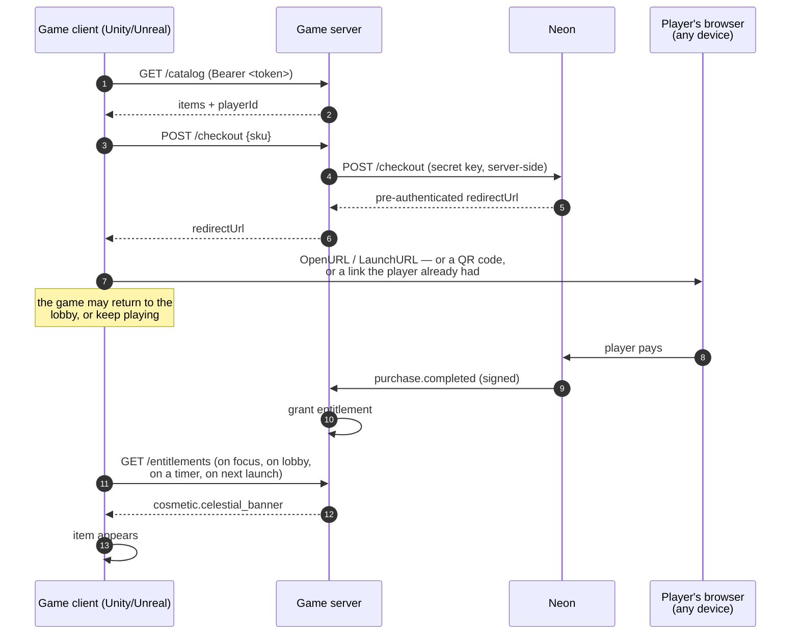

# 16 — Clients without a browser: Unity, Unreal, launchers

Added 2026-09-10. Expands [00 §7](00-integration-guide.md) from a four-row table
into the design it implies. The question that prompted it: *hosted checkout is a
web page — what happens to a Unity or Unreal client that has no browser, and is
showing a web page mid-game even workable?*

Short answer: the server does not change, there is no SDK to wait for, and the
web page should not appear mid-game at all. The rest of this document is why.

> **Sourcing.** Neon-side facts below come from Neon's live documentation,
> chiefly the [In-Game Payments guide](https://docs.neonpay.com/docs/accept-payments-with-neon-in-games)
> and the [integration overview](https://docs.neonpay.com/docs/getting-started).
> What is still unconfirmed is marked inline and carried to
> [05 — Open questions](05-open-questions-for-neon.md), per this repo's rule
> that unverified Neon behaviour is a question, not a statement.

## 1. Neon documents the in-game flow already

The premise "no browser means no support" is wrong twice over.

There is no Unity or Unreal SDK, and there does not need to be: the integration
surface is a REST contract plus a webhook, so one backend serves a web store, a
game client and a launcher at once. And Neon publishes a guide for exactly this
case. Its shape is the one this repository already implements:

1. the game asks **your backend** for a checkout — the API key never leaves it;
2. Neon returns a **pre-authenticated checkout link**, so the player lands on
   the page already logged in rather than authenticating inside a game overlay;
3. the player pays;
4. Neon's webhook tells your server to fulfil.

Step 2 is worth dwelling on. The usual objection to web checkout from a native
client is not the rendering — it is asking a player mid-session to type an email
and a password into something that does not look like the game. A
pre-authenticated link removes that step, which is most of the friction people
are actually objecting to when they say a web page is unacceptable in a game.

## 2. What differs, precisely

Everything in [01 — Architecture](01-architecture.md) holds unchanged. Only the
last mile moves:

| Concern | Web (this reference) | Unity / Unreal |
|---|---|---|
| HTTP | `fetch` | `UnityWebRequest` / `FHttpModule` |
| Opening the checkout | `location.assign(redirectUrl)` | `Application.OpenURL` / `FPlatformProcess::LaunchURL` |
| Identity | `cd_player` cookie | `Authorization: Bearer <uuid>` in save data |
| Return | `successUrl` on the same origin | deep link, or poll on focus regain |
| Fulfilment | webhook | webhook — identical |

The identity row is already built. `account()` reads a bearer token first and
falls back to the cookie; the catalogue response returns `playerId` so a token
client can persist it; CORS is an explicit allowlist that deliberately does
**not** send `Access-Control-Allow-Credentials`, so nothing in the design leans
on third-party cookies. Unity and Unreal have no cookie jar, and that was the
stated reason for building it that way — see
[08 — Storage and identity](08-storage-and-identity.md). The path was exercised
against the live sandbox server: with a bearer token set, the same requests
resolved to a different player than the cookie did
([09 — Sandbox run](09-sandbox-run.md)).

What a native client must **not** do is hold the API key. A shipped binary runs
on the player's machine: IL2CPP metadata gives up string constants to a dumper,
Mono decompiles to near-source, `.pak` files unpack, and a webview is still
JavaScript with remote debugging usually attached. A stolen payment key is a
merchant-account compromise, not a per-player one. `docs/08` records this as the
option that was never viable.

## 3. The game never has to watch the checkout

This is the part that dissolves the "web screen mid-game" problem, and it falls
out of a decision made for a different reason.

[02 — Checkout flow](02-checkout-flow.md) splits authority strictly: the
redirect is a UI event carrying no authority, and the **webhook is the only
thing that writes an entitlement**. The client merely polls
`/api/store/entitlements`.

The consequence for native clients is larger than it was for the web. If the
game does not need to observe the payment to be correct, then the payment does
not have to happen anywhere the game can see. It can complete in another
application, on another device, an hour later. The entitlement lands on the
`accountId` recorded at checkout creation, and the game finds it on its next
refresh.

That is not a theory. Both sandbox purchases in
[09 — Sandbox run](09-sandbox-run.md) were paid in a **different browser** from
the one that opened the checkout, and the entitlement still landed on the right
account and appeared in the original client.

There is one client-side obligation this creates, and it is easy to miss. A
client that only looks for a fulfilment while it believes a payment is in
flight will never see a purchase that completed out of band. The UE5 client in
[constellation-defense-unreal](https://github.com/Hakhyun-Kim/constellation-defense-unreal)
had precisely this defect: its state machine watched only `AwaitingPayment`, so
a webhook arriving after the player gave up left the cosmetic visible on the
castle while the state stayed "unknown" forever. The fix was to watch
`NotSeenYet` as well. Worth stating as a rule: **the entitlement refresh is
unconditional, not a payment subroutine.**

## 4. The three last-mile patterns

| Pattern | Where the page opens | Use it when |
|---|---|---|
| **External browser + return** | System browser, game backgrounds | PC, launchers, mobile. The default. |
| **Out-of-band web shop** | Nowhere near the game | The player buys on a phone or a web store; the game just receives. Familiar to Korean players. |
| **In-game webview** | Inside the game | Rarely. See below. |

**External browser + return.** Open it from a lobby, a pause menu, or a store
screen — never from active gameplay. Returning is the part people over-engineer:
a deep link back into the game (`successUrl` pointing at a custom scheme or a
universal link) is the polished version, but a plain **poll on focus regain** is
sufficient and cannot fail, because the webhook already did the work. Build the
deep link for the feel of it, not for correctness.

*Unconfirmed:* whether Neon accepts a non-`https` custom scheme as `successUrl`,
or whether the deep link must be reached via an `https` universal link that
redirects. Carried to [05](05-open-questions-for-neon.md).

**Out-of-band web shop.** The game contains no checkout at all. This is the
lowest-friction option on mobile, sidesteps the whole "web page in a game"
objection, and is what §3 makes safe.

**In-game webview.** Unreal's `WebBrowser` widget (CEF) or a third-party Unity
plugin. Two reasons to avoid it: Neon's guidance for iOS is that alternative
payments load **outside** the app in the player's default browser, and a webview
is still JavaScript in a process the player controls, so it buys no trust
boundary over the external browser while costing binary size, a CEF upgrade
treadmill, and an IME that will disappoint Korean players. Android is more
permissive — Neon's guidance there allows in-app payment flows and links out to
external checkout — but "permitted" is not "better".

## 5. The constraint is the platform, not the engine

Unity versus Unreal changes almost nothing. Where the build ships changes
everything.

| Target | External browser | Notes |
|---|---|---|
| PC, self-published launcher, web | Yes | No gatekeeper. Neon's core case. |
| Android | Yes | Neon's guidance: third-party in-app payment systems and links to external checkout flows are usable. Neon's own writing on this is US-focused. |
| iOS | Yes, and *only* the default browser, not a webview | Same caveat: the alternative-payment posture Neon documents is written around US rules. |
| Console (Switch / PlayStation / Xbox) | **No** | Platform holders forbid arbitrary external browser launches and mandate first-party IAP for digital goods. Out of scope for any web-checkout provider. |

**Korea is a deliberate gap in this table.** Korea amended the Telecommunications
Business Act to prohibit forcing a single in-app payment system, which is why a
Korean studio's instinct for a web shop is well founded — but the current
enforcement posture and the current App Store and Google Play policy text have
**not** been checked as part of this work, and Neon's public writing on
alternative payments is US-focused. [04 — Korean market notes](04-korea-market-notes.md)
covers currency, local rails, minors and refunds; store-policy compliance for a
mobile Korean release is a separate confirmation, listed in
[05](05-open-questions-for-neon.md).

## 6. What Neon could add — none of it an SDK

An SDK is the wrong ask. The REST contract is why one backend already serves
every client type; an SDK per engine would add versions to chase without moving
the trust boundary. Useful instead, in rough order of value to a native
integrator:

1. **Purchase lookup by `externalReferenceId`.** The reconciliation half of
   [05 §2](05-open-questions-for-neon.md). It matters more here than on the web:
   a native player who force-quits after paying has no tab to come back to, so
   the nightly sweep is the safety net.
2. **A documented deep-link contract for `successUrl`** — §4 above.
3. **A short URL or QR representation of the checkout link.** The "pay on your
   phone" flow is the honest answer for TV, VR and any client where text entry
   hurts, and it is the same `redirectUrl` either way.
4. **Guidance on link lifetime.** A pre-authenticated link is a bearer
   credential; how long it lives and whether it survives being pasted onto
   another device decides whether §3's out-of-band flow is a feature or a hole.

## 7. Not verified here

Stated plainly, because this document argues from a design that is only partly
exercised:

- **No checkout has been opened from inside a running engine.** The UE5 client
  compiles and its store layer passes against the mock payment service, but
  `LaunchURL` has never been pointed at a real Neon checkout, and nothing has
  been rendered on screen.
- **No Unity client exists** beyond the protocol smoke test in the game repo's
  `clients/`.
- **No deep link has been registered or tested** on any platform.
- **No mobile store submission** has been attempted, so every policy row in §5
  is a reading of published rules, not experience.

The claims ledger in [10 — What this proves](10-what-this-proves.md) is
unchanged by this document; nothing here adds a proven capability.
