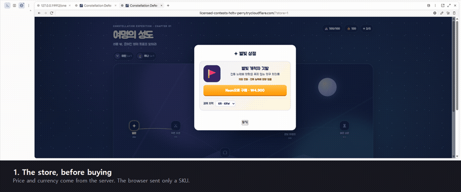
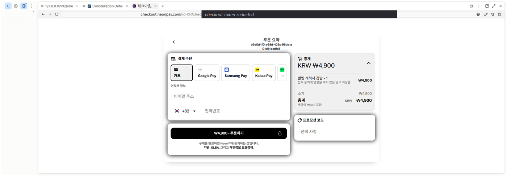
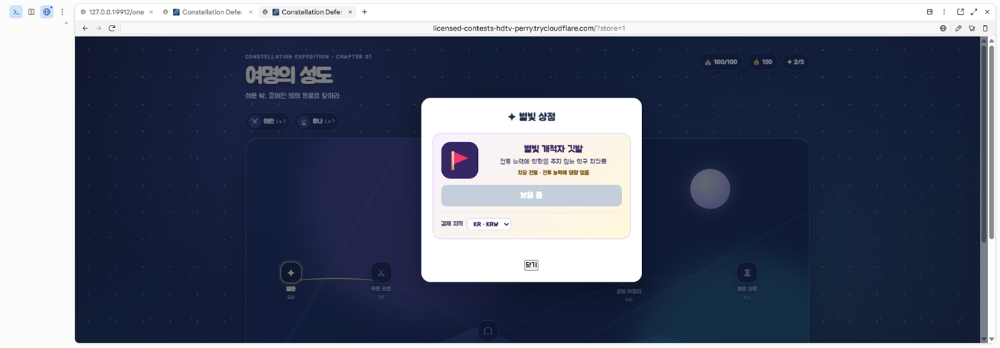
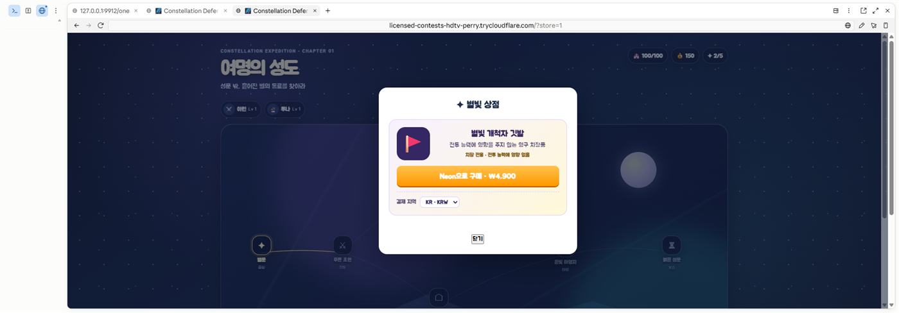

# Evidence

Screenshots and a short walkthrough from the live sandbox run described in
[09 — Sandbox run](../09-sandbox-run.md). Captured against the tunnel origin, so
the address bar shows the same host Neon delivered webhooks to.

The checkout token in the address bar of the second image is masked. It is a
sandbox value and harmless, but a payments repository is not the place to leave
one lying around.

## The guided tour, step by step (historical)

Thirteen screenshots of the earlier automatic `?tour=neon` tour, one per step, in
[tour/](tour/). The tour was replaced by the five-stage checkout inspector on
2026-09-05; the screenshots stay as a record of the lifecycle they show.

## Walkthrough

Also available as [walkthrough.mp4](walkthrough.mp4) (15s).

## Stills

### 1 — The store, before buying

Price and currency are rendered from the server's catalogue response. The browser
sent a SKU and a display language; it has no say in what anything costs.

### 2 — Neon hosted checkout

Rendered from `languageLocale: "ko-KR"`. The payment methods offered for KR are
**카드, Google Pay, Samsung Pay, Kakao Pay, Naver Pay** — the answer to the first
question for a Korean launch. The total reads `KRW ₩4,900` with
`세금에 ₩445 포함`, confirming both the 100× integer encoding (`490000`) and that
VAT is inclusive.

### 3 — After a real payment: owned

The button is disabled and reads 보유 중. The entitlement behind it was written by
a signed `purchase.completed` webhook, never by the redirect — the redirect only
opened this modal and started polling.

Both sandbox payments were made in a *different* browser from the one shown here.
The entitlement still landed on this player, because fulfillment is bound to the
`accountId` recorded when the checkout was created.

### 4 — After a refund: revoked, and buyable again

The entitlement is gone and the item is purchasable again. The purchase record is
not deleted — it stays in the ledger stamped with `refundedAt` and `refundId`.

This state was produced by a signed refund event carrying the **real**
`purchaseId`, with `externalReferenceId: null` to match Neon's documented example.
Neon's own refunds were failing server-side at the time; see
[09](../09-sandbox-run.md) for that defect report and for exactly what this does
and does not prove.

### 5 — English interface, Korean billing

The same player, with the game switched to English: `Buy with Neon · ₩4,900`, and
the billing region still `KR · KRW`. Language never moves the billing country,
because Neon binds currency to `playerCountry` and a Korean player reading English
is still in Korea.
