# The guided tour, step by step

Thirteen screenshots of `?tour=neon`, captured in order from one run of the
English build. The bot is playing the game for real in the background the whole
time; the panel on the right narrates, and every response shown in its dark
code box is what the local server returned at that moment — nothing is staged.

To watch it live instead of reading it:

```bash
npm run serve
# then open:
# http://127.0.0.1:8642/?lang=en&demo=expert&tour=neon&mute
```

| Step | What happens | Where the code is |
|---|---|---|
| 1 | Opens with the whole payment flow drawn as one diagram, then pushes the run into late waves | `flowSvg()` in `src/app/neontour.js` + `stage.hurry` hook |
| 2 | The citadel falls; the sell moment arrives | `stage.fall` hook |
| 3 | Catalogue fetched — price, currency, country all server-side | `server/catalog.mjs`, `GET /api/store/catalog` |
| 4 | Same product priced as KR and US side by side | `formatPrice()` in `server/catalog.mjs` |
| 5 | Checkout created from `{ sku, locale }` and nothing else | `POST /api/store/checkout` in `server/store-api.mjs` |
| 6 | A forged webhook is refused with 403 | `verifyWebhook()` in `server/store-api.mjs` |
| 7 | The real grant — same function a signed webhook reaches | `repository.fulfill()` |
| 8 | A transfer code moves the purchase to a fresh device | `/api/account/transfer-code` + `/api/account/claim` |
| 9 | The same event delivered again grants nothing new | idempotency ledger in `repository.mjs` |
| 10 | Buying an owned permanent item → 409 | ownership guard in `store-api.mjs` |
| 11 | Refund revokes; the purchase record stays | `repository.revoke()` |
| 12 | A grant arriving *after* the refund is refused | checkout-status guard in `fulfill()` |
| 13 | The architecture, one box per moving part | — |

## 1 — The run gets hard

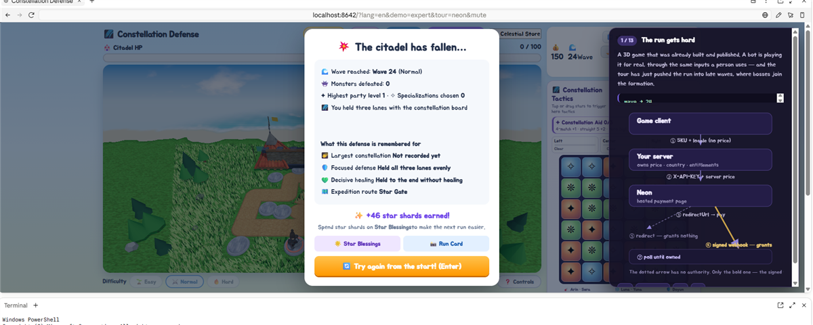

## 2 — The citadel falls

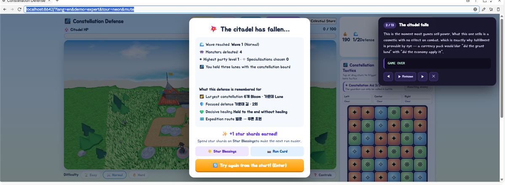

## 3 — The server decides the price

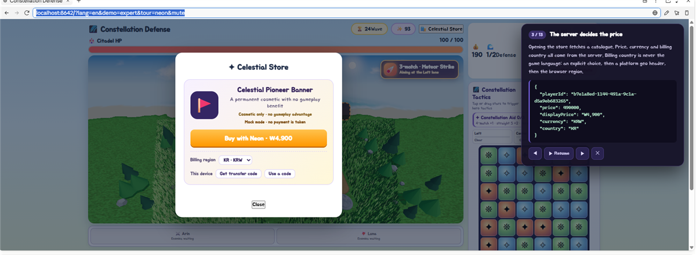

## 4 — ₩4,900 travels as 490000

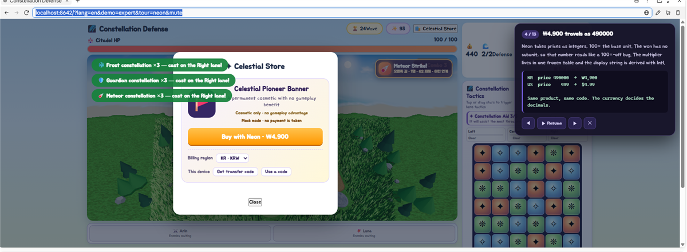

## 5 — The client sends a SKU and a language. Nothing else.

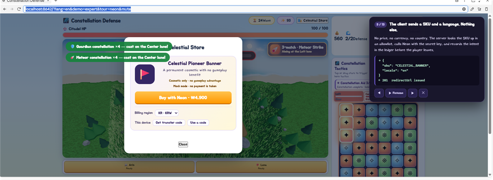

## 6 — A forged webhook: 403

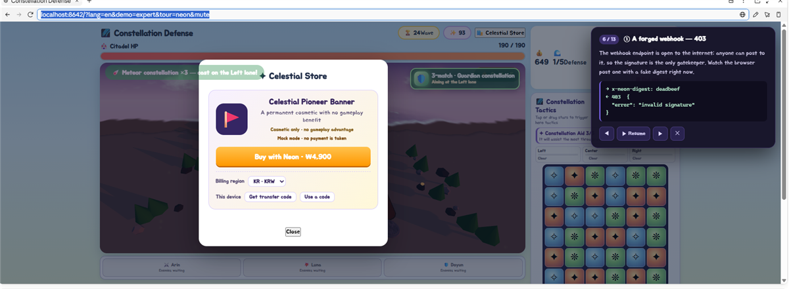

## 7 — The real grant

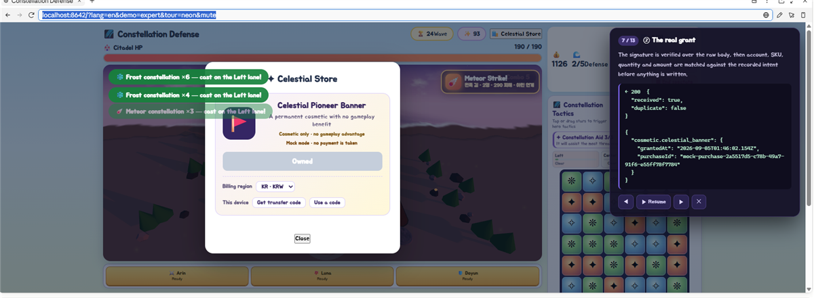

## 8 — The purchase belongs to an account, not this device

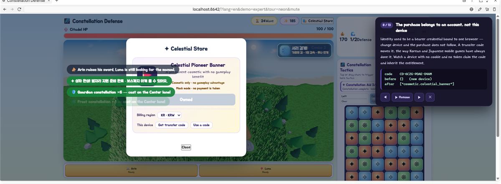

The code shown (`CD-…`) was consumed the moment this screenshot was possible —
transfer codes are single-use and this one is already spent.

## 9 — Delivered twice, granted once

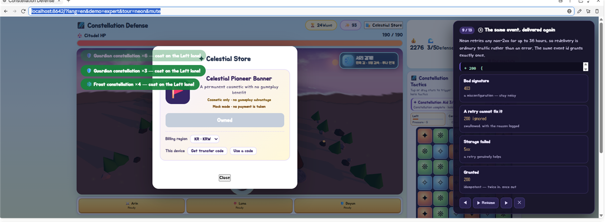

## 10 — Buying what you already own: 409

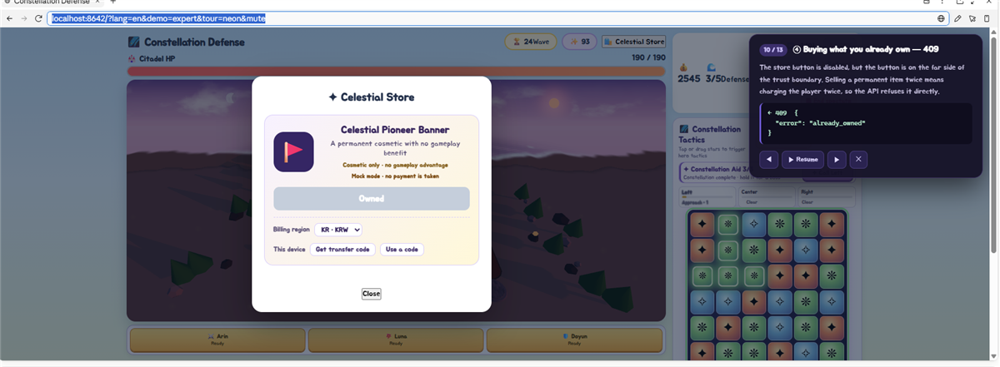

## 11 — Refund: the item comes back

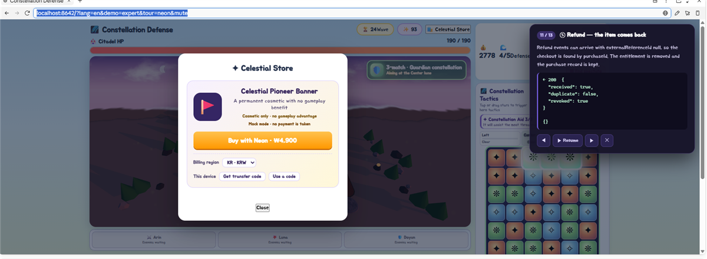

## 12 — A grant arriving after the refund

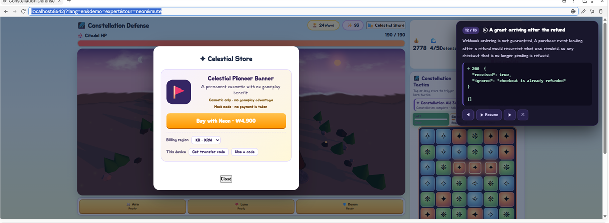

## 13 — The server does not care what kind of client is calling

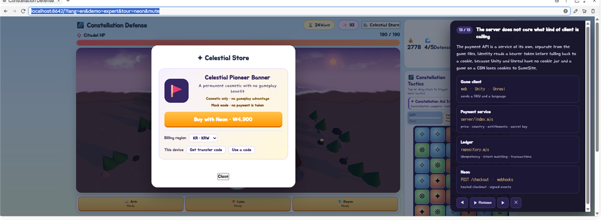

## When the payment server is not running

If the API cannot be reached — a static deployment, or the server simply not
started — the tour does not fail blank. It says what to run, notes that a browser
page cannot start a server itself, and offers a retry:

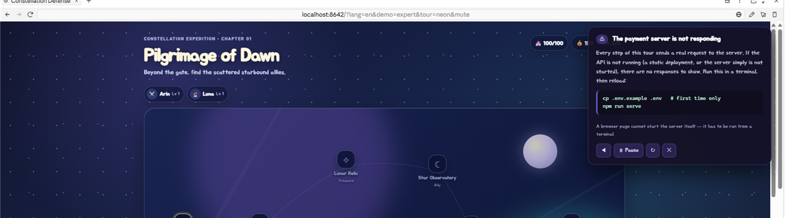
